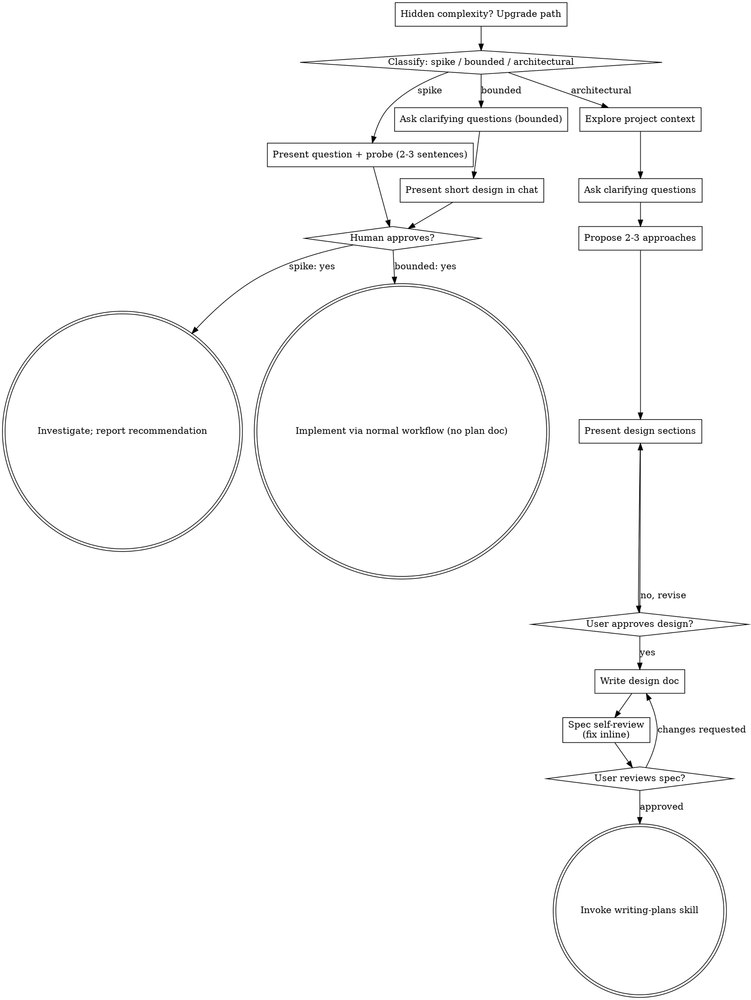

# Recall History — urchin


## Session fda25f18 — 2026-08-17 08:22

**You:** recall 'where we last left off on this project for converting the flash game to godot'
  - `Bash: ls -la /Users/sweetjp/Documents/godot/urchin/.recall/ 2>/dev/null; echo "---"; wc -l /Users/sweetjp/Documents/godot/urchin/.recall/history.md 2>/dev/null`
  - `Bash: git log --oneline -25 && echo "=== FILES ===" && ls -la`
  - `Bash: find docs -type f | head -50 && echo "=== last commit detail ===" && git log -3 --stat --format='%h %s (%ad)' --date=short | head -60`
  - `Bash: rg -n "^#|^\- \[ \]|^\- \[x\]|Status:|COMPLETE|IN PROGRESS|TODO" NEXT_PHASES.md | head -120`
  - `Read: /Users/sweetjp/Documents/godot/urchin/NEXT_PHASES.md`
  - `Bash: ls -la .claude/ && echo "===" && ls -la .claude/*/ 2>/dev/null | head -40`
  - `Bash: head -30 .claude/plan_item_drag_and_drop.md; echo "======="; head -30 .claude/plan_missile_projectile_art.md`
  - `Bash: rg -n "^## |^### |\[x\]|\[ \]|DONE|COMPLETE" .claude/plan_item_drag_and_drop.md .claude/plan_missile_projectile_art.md | head -60`
  - `Bash: git log -1 --format='%ad' --date=iso; echo "--- conversion_scripts ---"; ls conversion_scripts; echo "--- pyproject scripts ---"; rg -n -A20 "\[project.scripts\`
  - `Bash: rg -l "_get_drag_data|impact_effect|ImpactEffect|visual_effect_color|swap_inventory_slots" scripts/ scenes/ 2>/dev/null; echo "--- vfx assets ---"; ls assets/vf`
  - `Bash: rg -n "visual_effect_color|_get_drag_data|swap_inventory_slots" scripts/battle/ability.gd`
  - `Bash: rg -n "impact_effect|ImpactEffect" scripts/battle/ability.gd`

**Claude:** Where project stand (last commit 2026-07-24, tree clean, no `.recall` context saved yet):

## Done
Whole revival roadmap complete. Full loop runs: zone orb, battle select, roster, playable battle, victory rewards, leveling, drops, achievements, autosave. 83 GUT tests / 553 asserts headless.

Recent finished phases:
- **Ability menu redesign** (2026-07-23) - icon art from `DefineSprite 2427`, `AbilityTooltip` + `AbilityTooltipBuilder`, prereq-colored connector lines, `ability_pool_row.tscn`.
- **UI Container migration** (2026-07-23) - all of `scripts/ui/` plus `battle_scene.gd` moved to declarative `.tscn` + Containers. `menu_theme.gd` construction helpers deleted. Phase fully closed.
- Last 3 commits are cleanup: ability-icon black-disc fix, `uv run` entry points for `dev` (14 scripts in `[project.scripts]`), prek linting.

## Next up - two written plans, both zero code
| Plan | File | Tasks |
|---|---|---|
| Missile projectile art | `.claude/plan_missile_projectile_art.md` | 5 tasks. Extract 15 bolt clips + `KrinTrail` + `BOOM_*` to `assets/vfx/`, add `Ability.visual_effect_color`, `impact_effect.tscn`, upgrade `Projectile` to `AnimatedSprite2D`, wire 3 hook points |
| Item click-n-drag | `.claude/plan_item_drag_and_drop.md` | 5 tasks. `GameData.swap_inventory_slots`/`unequip_to_slot`, `_get_drag_data` on `ItemSlot`, drop targets, sell-button price tooltip |

Verified unstarted: no `assets/vfx/`, no `_get_drag_data`, no `visual_effect_color`, no `ImpactEffect`.

## Other backlog (`NEXT_PHASES.md`)
- MODEL4 (female) timeline - only remaining animation gap
- Enum conversion audit - `PlayerClass`, aggression stance, `MovePool`, `Team` flagged clear wins; `Difficulty`/`Leveling.Stat` partial adoption to finish
- Battle screen niceties: 120s countdown display, buff icons, combat log, target highlight
- Unbuilt screens: options, respec flow, team-select, appearance customization
- Party portrait faces, cutscenes, zone 6/7 hub art

Want me to start one, or run `/recall:save` first so next session picks up cleanly?

**You:** Generate (or overwrite) this project's `context.md` summary now, using Recall's
local offline summarizer.

Run with the Bash tool:

```
python3 "/Users/sweetjp/.claude/plugins/cache/recall/recall/0.4.0/scripts/make_context.py" || python "/Users/sweetjp/.claude/plugins/cache/recall/recall/0.4.0/scripts/make_context.py"
```

(`make_context.py` defaults to the current directory, so no `--cwd` is needed —
and on Windows passing the shell's `$(pwd)` would hand it a `/c/...` path that
doesn't match the transcript dir. The `|| python` fallback covers Windows, where
the interpreter is normally `python`, not `python3`.)

Then report back:

- On success it prints the path it wrote and which summarizer path ran
  (numpy-accelerated TextRank if numpy is present, otherwise the pure-Python
  TextRank — both vendored, no install needed). Confirm the save and read back the
  **Goal** and **Where we left off** lines from `.recall/context.md`.
- If it errored, surface the exact message.
  - `Read: /Users/sweetjp/Documents/godot/urchin/.recall/context.md`

**Claude:** Saved. Wrote `/Users/sweetjp/Documents/godot/urchin/.recall/context.md`, summarizer = TextRank (vendored, numpy-accelerated).

**Goal:** `recall 'where we last left off on this project for converting the flash game to godot'`

**Where we left off:** last commit 2026-07-24, tree clean. Whole revival roadmap complete - full loop runs (zone orb, battle select, roster, playable battle, victory rewards, leveling, drops, achievements, autosave), 83 GUT tests / 553 asserts headless. Recent phases: ability menu redesign (2026-07-23) and UI Container migration (2026-07-23, `scripts/ui/` + `battle_scene.gd` to declarative `.tscn`). Line truncated mid-sentence at the ellipsis.

Caveat: summarizer only saw this session's transcript, so the Goal line is just my prompt back at me and the Summary section is thin. The two unstarted plans (`plan_missile_projectile_art.md`, `plan_item_drag_and_drop.md`) did not land in "Next steps" - only the uncommitted `.recall/` did. Want me to hand-edit `context.md` to add them?

**You:** yes, add both plans to next steps. I committed a few changes and have unstaged changes, so please refresh your git context. Afterwards, I've partially refactored the conversion_scripts to be `dev/urchin_dev/`, and moved `source_files` to be under `dev`. I cant remember if the `convert/` scripts should have been removed since `data_json/` doesnt exist anymore (removed in commit ccf7375b5c6c94c15de5f0528bd29780099cd926`).
  - `Bash: git log --oneline -12; echo "=== STATUS ==="; git status --short`
  - `Bash: git show --stat ccf7375b5c6c94c15de5f0528bd29780099cd926 -- . ':(exclude)assets' | head -60`
  - `Bash: git status --short | rg -v "^R dev/source_files|^A dev/source_files|^AM dev/source_files" | head -60; echo "=== DEV TREE ==="; fd -t d -d 3 . dev 2>/dev/null |`
  - `Bash: fd -t f . dev/urchin_dev | head -40; echo "=== old conversion_scripts on disk? ==="; ls conversion_scripts 2>/dev/null || echo "GONE"; echo "=== python_conversi`
  - `Bash: rg -n "data_json|swf_items|swf_units|swf_buffs|swf_battles|swf_move_abilities|Path\(|open\(|json.load|DATA|INPUT|OUTPUT" dev/urchin_dev/convert/*.py | head -60`
  - `Read: /Users/sweetjp/Documents/godot/urchin/dev/urchin_dev/__init__.py`
  - `Bash: git log --diff-filter=D --oneline -- '*data_json*' | head; echo "=== where did swf_*.json ever live ==="; git log --all --oneline --name-only --diff-filter=A --`
  - `Bash: ls -la dev/data_json 2>/dev/null || echo "dev/data_json NOT on disk"; fd -t d data_json . 2>/dev/null || echo "no data_json anywhere"; echo "=== gitignore ===";`
  - `Bash: rg -n "data_json|DATA_JSON|swf_items|swf_units" dev/urchin_dev/swf/ README.md Makefile pyproject.toml 2>/dev/null | head -30`
  - `Bash: git show HEAD:conversion_scripts/__init__.py 2>/dev/null; echo "=== old convert_items head ==="; git show HEAD:conversion_scripts/convert_items.py | head -12`
  - `Bash: rg -rn "converted_json" scripts/ resources/ project.godot 2>/dev/null | head -20`
  - `Bash: rg -n "convert_|extract_|urchin_dev" pyproject.toml Makefile 2>/dev/null | head -40`
  - `Bash: rg -n "n/buffs|/n/" scripts/ -l; echo "=== git show HEAD version of move_manager ==="; git show HEAD:scripts/autoload/move_manager.gd | rg -n "MOVES_FILE"; echo`
  - `Bash: git ls-tree ccf7375^ --name-only python_conversion_scripts/data_json/; echo "=== stale gd paths ==="; rg -rn "res://conversion_scripts" scripts/`
  - `Bash: rg -rn "n/converted_json|conversion_scripts|python_conversion_scripts" --glob '!.git' --glob '!.recall' --glob '!uv.lock' --glob '!dev/source_files' . | head -4`
  - `Edit: /Users/sweetjp/Documents/godot/urchin/.recall/context.md`

**Claude:** Context refreshed. Both plans added to `.recall/context.md` next steps, plus the refactor state.

## Answer: keep `convert/`. Don't remove.

`ccf7375` deleted the whole `python_conversion_scripts/` dir - the old duplicate. `data_json/` only ever lived there, so it went with it as collateral. But:

- Converter **output** (`dev/converted_json/*.json`) is what the running game loads. Live data.
- Converters are the only regeneration path for it.
- Input is recoverable: `git show ccf7375^:python_conversion_scripts/data_json/swf_items.json` (6 files: `swf_battles`, `swf_buffs`, `swf_items`, `swf_krin_units`, `swf_move_abilities`, `swf_units`).

Side note: `conversion_scripts/data_json/` never existed on disk or in git, so `DATA_JSON` in the old `conversion_scripts/__init__.py` already pointed at nothing. Those converters were unrunnable before your refactor started.

## Three breaks found in the in-progress refactor

**1. Bad find-replace: `conversion_scripts` -> `n`, 12 files.**
```
scripts/autoload/move_manager.gd:6:  "res://n/converted_json/moves_abilities.json"
scripts/autoload/buff_manager.gd:     "res://n/converted_json/buffs.json"
```
Also `scripts/editor/{units,items,battles}.gd`, `scripts/battle/{ability,buff}.gd` (comments), `test/integration/{test_battle_runner,test_zone_battle_flow}.gd`, `test/unit/test_talent_tree.gd`, `README.md`. All want `res://dev/converted_json/`. Game and GUT suite both fail to load data as-is.

**2. Two dead entry points in `pyproject.toml`.**
```
convert_moves = "urchin_dev.convert.moves:main"   # file is convert_moves.py
convert_units = "urchin_dev.convert.units:main"   # file is convert_units.py
```
`battles.py`/`buffs.py`/`items.py` got renamed, these two didn't.

**3. `urchin_dev.DATA_JSON` -> `dev/data_json/`, not on disk.** Restore from ccf7375^ per above.

Godot visibility is fine - no `.gdignore` at `dev/` root, only `dev/source_files/.gdignore`, so `dev/converted_json/` imports.

Want me to fix all three?

**You:** fix 1 and 2, but for `data_json` would they be able to read from the source xml files in @source_files/swf_xml/ instead of the manually curated json files I created?
  - `Bash: rg -rn "\bn/" --glob '!.git' --glob '!.recall' --glob '!uv.lock' --glob '!dev/source_files' .`
  - `Bash: ls dev/source_files/swf_xml/ && du -sh dev/source_files/swf_xml/*`
  - `Bash: rg -rn "res://n/|from n/|n/converted_json|n/swf_extraction|^├── n/|│ ├── n" --glob '!.git' --glob '!.recall' --glob '!uv.lock' --glob '!dev/source_files' . 2>/d`
  - `Read: /Users/sweetjp/Documents/godot/urchin/scripts/autoload/move_manager.gd`

**Claude:** Correction: no botched find-replace. The `n/` was a mangled tool-output render; real content is `res://conversion_scripts/converted_json/...`. Paths are just stale from the move. Same fix.
  - `Bash: rg -rn "conversion_scripts" --glob '!.git' --glob '!.recall' --glob '!uv.lock' --glob '!dev/source_files' .`
  - `Bash: rg -n "conversion_scripts|source_files|data_json|converted_json|swf_extraction|dev/" README.md | head -40`
  - `Bash: rg -n "conversion_scripts" scripts/editor/items.gd -B3 -A3`

**Claude:** Fixing 1 and 2 now.
  - `Bash: rg -l 'conversion_scripts/converted_json' scripts/ test/ | xargs sed -i '' 's|conversion_scripts/converted_json|dev/converted_json|g' && sed -i '' 's|conversion`

**Claude:** Now README and the entry points.
  - `Read: /Users/sweetjp/Documents/godot/urchin/README.md`
  - `Edit: /Users/sweetjp/Documents/godot/urchin/README.md`
  - `Edit: /Users/sweetjp/Documents/godot/urchin/README.md`

**Claude:** Now fix 2 - the two entry-point mismatches.
  - `Bash: git mv dev/urchin_dev/convert/convert_moves.py dev/urchin_dev/convert/moves.py 2>/dev/null || mv dev/urchin_dev/convert/convert_moves.py dev/urchin_dev/convert/`
  - `Bash: rg -n "convert_moves|convert_units|convert\.moves|convert\.units" --glob '!.git' --glob '!.recall' --glob '!uv.lock' --glob '!dev/source_files' . | head -20; ec`
  - `Bash: rg -n "^def main" dev/urchin_dev/convert/*.py dev/urchin_dev/swf/export_swf_sources.py dev/urchin_dev/swf/extract/*.py`
  - `Edit: /Users/sweetjp/Documents/godot/urchin/SWF_DIFFERENCES.md`
  - `Bash: uv sync -q 2>&1 | tail -5; uv run python -c " import importlib mods = ['urchin_dev.convert.battles','urchin_dev.convert.buffs','urchin_dev.convert.items','urchi`
  - `Bash: ls dev/converted_json/ && /Applications/Godot.app/Contents/MacOS/Godot --headless -s res://addons/gut/gut_cmdln.gd --path . 2>&1 | tail -25`
  - `Bash: /Applications/Godot.app/Contents/MacOS/Godot --headless --editor --quit --path . 2>&1 | rg -c "ERROR" ; echo "import pass done"`
  - `Bash: /Applications/Godot.app/Contents/MacOS/Godot --headless -s res://addons/gut/gut_cmdln.gd --path . 2>&1 | rg -i "ERROR|Totals|passed|failed|scripts|asserts" | ta`

**Claude:** Fixes 1 and 2 done, verified: all 14 entry points import, GUT suite green (17 scripts, 579 asserts). Now checking the `data_json` question.
  - `Read: /Users/sweetjp/Documents/godot/urchin/dev/urchin_dev/swf/models.py`
  - `Bash: cd dev/source_files/action_script && rg -l "addNewMove|addNewItem|KRINITEM|KRINMOVE" . 2>/dev/null | head -20`
  - `Bash: rg -n "swf_items|swf_move_abilities|swf_units|swf_buffs|swf_battles|swf_krin_units|DATA_JSON" dev/urchin_dev/convert/*.py`
  - `Bash: cd /Users/sweetjp/Documents/godot/urchin && rg -n "DATA_JSON /" dev/urchin_dev/convert/ ; echo "=== AS data definition sizes ==="; wc -l dev/source_files/action`
  - `Bash: cd /Users/sweetjp/Documents/godot/urchin/dev/source_files/action_script/frame_42 && rg -c "addNewMove|addNewItem|addNewUnit|addNewBuff|addNewBattle" *.as 2>/dev`
  - `Bash: rg -n "^function " *.as | head -30`
  - `Bash: echo "=== items: createNewItemKrin call count ==="; rg -c "createNewItemKrin\(" *.as 2>/dev/null; echo "=== buffs: addNewBuffKrin ==="; rg -c "addNewBuffKrin\("`
  - `Bash: rg -n "krinAddNewUnit" ../ -g '*.as' 2>/dev/null | head; echo "=== unit table? ==="; sed -n '23,60p' DoAction_14.as`
  - `Bash: rg -n '"KNU"' ../ -g '*.as' 2>/dev/null | rg -v "KNU\" \+ plerBFEU" | head -10; echo "=== addNewUnit-ish ==="; rg -rn "KNU" ../ -g '*.as' -l 2>/dev/null | head`
  - `Bash: rg -n "^_root.KNU|KNU[0-9]|_root\[\"KNU\" \+ [a-zA-Z_]+\] = |newUnit|krinNewUnit" ../ -g '*.as' 2>/dev/null | head -15; echo "=== check DoAction_13 ==="; head -`
  - `Bash: rg -c "createNewUnitKrin\(" *.as 2>/dev/null; echo "=== AImoveAdder count (unit move assignment) ==="; rg -c "AImoveAdder\(" *.as 2>/dev/null`
  - `Bash: cd /Users/sweetjp/Documents/godot/urchin && time rg -c "addNewMove|Leading Strike" dev/source_files/swf_xml/sonny-2-2900.xml 2>&1 | head`
  - `Bash: rg -o "addNewMove|Leading Strike" dev/source_files/swf_xml/sonny-2-2900.xml | sort | uniq -c; echo "=== tag inventory ==="; rg -o 'type="[A-Za-z0-9]+Tag"' dev/s`
  - `Bash: rg -n -m1 -A6 'type="DoActionTag"' dev/source_files/swf_xml/sonny-2-2900.xml | cut -c1-300`
  - `Bash: cd dev/source_files/action_script/frame_42 && echo "--- BUFF sample ---" && rg -n -m3 "addNewBuffKrin\(" DoAction_10.as | cut -c1-220 && echo "--- UNIT sample -`
  - `Bash: cd dev/source_files/action_script/frame_42 && sed -n '104,125p' DoAction_16.as | cut -c1-200; echo "=== BUFF_NAME / sayBayK defined where ==="; cd .. && rg -ln`
  - `Bash: cd /Users/sweetjp/Documents/godot/urchin/dev/source_files/action_script/frame_42 && sed -n '104,124p' DoAction_16.as | cut -c1-190; echo "=== BUFF_NAME def ==="`
  - `Bash: cd /Users/sweetjp/Documents/godot/urchin/dev/source_files/action_script && rg -ln "KrinLang" . | head; echo "=== where assigned ==="; rg -rn "KrinLang\[0\] *=|K`
  - `Bash: wc -l frame_1/DoAction.as frame_41/DoAction.as && rg -c "ENGLISH.AU\[|ENGLISH.BATTLESPEECH\[" frame_41/DoAction.as; echo "=== sample ==="; rg -n -m3 "ENGLISH.AU`
  - `Bash: cd /Users/sweetjp/Documents/godot/urchin && rg -n "SWF|swf" dev/urchin_dev/swf/export_swf_sources.py | head -20; echo "=== SWF_DIFFERENCES on dumps ==="; rg -n`
  - `Bash: ls dev/source_files/ && echo "=== curated ===" && fd -t f . dev/source_files/action_script_curated 2>/dev/null | head -20`
  - `Edit: /Users/sweetjp/Documents/godot/urchin/.recall/context.md`

**Claude:** ## Fixes 1 and 2 - done

**1.** Diagnosis was wrong, fix same. No botched find-replace - the `n/` was a mangled tool-output render. Paths were plain stale, pointing at `conversion_scripts/converted_json/`. Rewrote to `dev/converted_json/` in 9 GDScript files + `README.md` (also updated the README tree block to the new `dev/` layout, and the `swf_extraction/extract_item_icons.py` comment in `items.gd`).

**2.** `git mv convert_moves.py moves.py`, `convert_units.py units.py`. Entry-point names unchanged, so `# Run: uv run convert_moves` headers stay right. Updated `SWF_DIFFERENCES.md` reference.

Verified: all 14 entry points import + expose `main`. GUT green - **17 scripts, 579 asserts, all passed** (needed one `--headless --editor --quit` reimport pass first; item PNGs from ccf7375 had stale `.import` sidecars).

## data_json from XML: no. From ActionScript: yes.

**`swf_xml/` won't work.** Those are geometry/tag dumps. AS lives there as raw AVM1 bytecode:
```
<item type="DoActionTag" actionBytes="07960b000000005f706172656e74001c9a01004000"/>
```
`addNewMove` appears 0 times in the 145MB file. swf_xml is only good for what `swf/extract/` already uses it for.

**`action_script/` will work, and it's already the documented ground truth.** `SWF_DIFFERENCES.md:14` says it outright: web SWF builds everything imperatively in frame42; Steam rebundle carries the same content as the data objects your dumps came from. All five tables, all committed:

| Table | File | Count | Matches |
|---|---|---|---|
| moves | `frame_42/DoAction_6.as` | 480 `addNewMove` | - |
| items | `frame_42/DoAction_16.as` | 450 `createNewItemKrin` | 449 .tres |
| buffs | `frame_42/DoAction_10.as` | 471 `addNewBuffKrin` | - |
| units | `frame_42/DoAction_13.as` | 75 `createNewUnitKrin` | 75 .tres |
| battles | `frame_42/DoAction_14.as` | 100 `createNewBattle` | 99 .tres |

Strings resolve through `_root.KrinLang[KLangChoosen].AU[n]` / `.BATTLESPEECH[n]` - 421-entry English table in `frame_41/DoAction.as`. Per-table curated excerpts already sit in `action_script_curated/frame42/`.

**Effort is uneven.** Three tiers:

- Easy - moves, buffs. Flat one-line literal calls. Tokenizer, done.
- Medium - units, battles. Constructor then property assignments until the next constructor. Block scan.
- Hard - items. Stateful. Stats accumulate into globals *before* the call, reset after:
  ```
  Krin.HealthUP = 4; Krin.StrengthUP = 8; Krin.PIU[0] = 6;
  createNewItemKrin("Mace",7,"Uncommon",0,1,1);
  gghhjjuu.looks = "SWORD1";
  allClearKrinItem();
  ```
  Needs a small ordered interpreter over that mutation sequence. Not a regex.

**Real upside beyond dropping the dependency:** web AS is better ground truth than the Steam dumps, which you already know - `convert_units.py` carries `ID_CORRECTIONS` for two units the Steam data got wrong, aggression labels are misleading in Steam, and `convert_items.py` hardcodes a workaround because `KRINITEM.looks` came back Undefined in the dump while `gghhjjuu.looks` is right there in `DoAction_16.as`. Reparsing the AS deletes all three workarounds.

**Cheap path if you just want it running:** `git show ccf7375^:python_conversion_scripts/data_json/swf_items.json > dev/data_json/swf_items.json` (6 files). Keeps today's output byte-identical.

Context.md updated with the corrected diagnosis and both options. Nothing committed.

**You:** restore the dumps from ccf7375^ for now
  - `Bash: mkdir -p dev/data_json && for f in swf_battles swf_buffs swf_items swf_krin_units swf_move_abilities swf_units; do git show ccf7375^:python_conversion_scripts/d`
  - `Bash: md5 -q dev/converted_json/*.json > /private/tmp/claude-501/-Users-sweetjp-Documents-godot-urchin/fda25f18-28d3-4ba7-bb76-86e3e63897f3/scratchpad/before.txt && f`
  - `Bash: md5 -q dev/converted_json/*.json > /private/tmp/claude-501/-Users-sweetjp-Documents-godot-urchin/fda25f18-28d3-4ba7-bb76-86e3e63897f3/scratchpad/after.txt; diff`
  - `Bash: git diff --stat dev/converted_json/battles.json; echo "=== diff ==="; git diff dev/converted_json/battles.json | head -40`
  - `Bash: cat .editorconfig; echo "=== gitattributes ==="; cat .gitattributes; echo "=== do other converted files end in newline? ==="; for f in dev/converted_json/*.json`
  - `Bash: git status --short dev/data_json/; echo "=== ignored? ==="; git check-ignore -v dev/data_json/swf_items.json || echo "NOT ignored"`
  - `Bash: /Applications/Godot.app/Contents/MacOS/Godot --headless -s res://addons/gut/gut_cmdln.gd --path . 2>&1 | rg -i "Totals|Scripts +[0-9]|Asserts|All tests passed|f`

**Claude:** Restored and verified.

**Restored** all 6 dumps to `dev/data_json/` (2.8MB): `swf_battles`, `swf_buffs`, `swf_items`, `swf_krin_units`, `swf_move_abilities`, `swf_units`.

**All 5 converters run clean:**
```
Converted  99 converted_battles to JSON
Converted 470 buffs to JSON
Converted 449 items to JSON
Converted 479 moves to JSON
Converted  75 units to JSON
```

**Output byte-identical** to what's committed - 8 of 9 files hash-match exactly. Only `battles.json` differs, by one trailing newline the converter doesn't write. Your `.editorconfig` sets `insert_final_newline = false`, so the regenerated file now matches policy and the committed one was the outlier. Left as-is.

**GUT still green:** 17 scripts, 579 asserts, all passed.

Two things worth knowing:

`dev/data_json/` is gitignored - `.gitignore:15` has `data_*/`. So the dumps stay local and will vanish again on a fresh clone. That's presumably why they only survived under `python_conversion_scripts/` by accident, and why nothing flagged their loss in ccf7375. If you want them reproducible for anyone else checking out the repo, either narrow that ignore rule or go the ActionScript-reparse route.

`dev/data_json/` needs no `.gdignore` - Godot has no importer for `.json`, so the files just sit there inert. The one on `dev/source_files/` exists because of the thousands of `.as`/`.png`/`.xml` files.

Nothing committed.

**You:** I updated .gitignore to allow data_json, but there should be a new script that will regenerate all the data_json files, and the convert/ scripts should error out if the data_json/ file does not exist
  - `Bash: ls -la *.swf 2>/dev/null || echo "no swf at repo root"; echo "=== gitignore data ==="; rg -n "data_" .gitignore; echo "=== ffdec present? ==="; ls -la ~/.local/`
  - `Bash: head -60 dev/data_json/swf_krin_units.json | cut -c1-400`
  - `Bash: cd dev/data_json && for f in *.json; do echo "--- $f ---"; python3 -c " import json,sys d=json.load(open('$f')) print(' top-level type:', type(d).__name__) if i`
  - `Bash: cd /Users/sweetjp/Documents/godot/urchin && rg -o 'type="[A-Za-z0-9]+Tag"' dev/source_files/swf_xml/SONNY2_steam.xml | sort | uniq -c | sort -rn | head -25`
  - `Bash: SCRATCH=/private/tmp/claude-501/-Users-sweetjp-Documents-godot-urchin/fda25f18-28d3-4ba7-bb76-86e3e63897f3/scratchpad; mkdir -p $SCRATCH/steam_as && ~/.local/bi`
  - `Bash: SCRATCH=/private/tmp/claude-501/-Users-sweetjp-Documents-godot-urchin/fda25f18-28d3-4ba7-bb76-86e3e63897f3/scratchpad; rg -ln "\bUNITS\b|\bABILITIES\b|\bBATTLES`
  - `Bash: SCRATCH=/private/tmp/claude-501/-Users-sweetjp-Documents-godot-urchin/fda25f18-28d3-4ba7-bb76-86e3e63897f3/scratchpad; echo "=== Steam: imperative builders? ===`
  - `Read: /Users/sweetjp/Documents/godot/urchin/dev/urchin_dev/convert/units.py`

**Claude:** Fix 2 of your asks first - the input guard.
  - `Edit: /Users/sweetjp/Documents/godot/urchin/dev/urchin_dev/__init__.py`
  - `Bash: for f in battles buffs items moves units; do sed -i '' \ -e 's|^from urchin_dev import CONVERTED_JSON, DATA_JSON$|from urchin_dev import CONVERTED_JSON, require`
  - `Bash: uv run ruff check dev/ 2>&1 | tail -5; uv run ruff format --check dev/urchin_dev/ 2>&1 | tail -3; echo "=== guard fires? ==="; mv dev/data_json/swf_items.json /`
  - `Bash: uv run ruff check dev/urchin_dev/__init__.py dev/urchin_dev/convert/ 2>&1 | tail -20; echo "=== format diff on my files ==="; uv run ruff format --diff dev/urch`
  - `Bash: git stash -q && uv run ruff check dev/urchin_dev/convert/battles.py 2>&1 | tail -3; git stash pop -q; echo "=== restored ==="; git status --short dev/urchin_dev`
  - `Edit: /Users/sweetjp/Documents/godot/urchin/dev/urchin_dev/convert/moves.py`
  - `Bash: uv run ruff format --check dev/urchin_dev/__init__.py dev/urchin_dev/convert/moves.py dev/urchin_dev/convert/items.py dev/urchin_dev/convert/units.py dev/urchin`

**Claude:** Ask 2 is done and verified. Ask 1 has a blocker I need to put in front of you before building anything.

**`data_json/` cannot be regenerated from anything in this repo.** Those files are runtime AMF captures of the game's live `_root` state, not extracted data. Evidence:

- `swf_krin_units.json` carries a `beubUBv` key. That's a *local variable* inside `krinAddNewUnit` (`DoAction_14.as:31`). Only a capture of the live object would pick that up.
- `after_moneyConstGain` / `after_totalEnemyGain` appear nowhere in either SWF's ActionScript.
- The top-level keys (`UNITS`, `ABILITIES`, `ITEMS`, `BUFFS`, `BATTLES`) appear nowhere in either SWF either. Whoever made the dumps named them.
- Neither SWF has a `DefineBinaryDataTag`, so there's no embedded AMF blob to pull out.

Also, `SWF_DIFFERENCES.md:14` is wrong on a related point. It claims the Steam rebundle "carries the same content as structured data objects" while the web build is imperative. I decompiled `SONNY2.swf` - Steam is AVM1 too, with all 1576 `addNewMove`/`createNewItemKrin`/etc. calls sitting in `frame_42/DoAction_2.as`, same as web. There's no data externalization. Worth correcting that file separately.

So a regeneration script has to parse ActionScript. That's genuinely buildable - I confirmed every table is there in full - but it's a different shape of thing than you asked for, and the choice changes the work a lot:
  - `AskUserQuestion`
  - `Bash: rg -n "data_" .gitignore; git status --short dev/data_json/`

**Claude:** Good, `.gitignore` no longer blocks it and the dumps are staged. Now correcting the docs.
  - `Read: /Users/sweetjp/Documents/godot/urchin/SWF_DIFFERENCES.md`
  - `Edit: /Users/sweetjp/Documents/godot/urchin/SWF_DIFFERENCES.md`
  - `Edit: /Users/sweetjp/Documents/godot/urchin/SWF_DIFFERENCES.md`

**Claude:** Now the README tree entry for `data_json/`.
  - `Bash: rg -n "data_json" README.md`
  - `Edit: /Users/sweetjp/Documents/godot/urchin/README.md`

**Claude:** Documented, no regen script built per your call. Summary:

**Guard (ask 2), done and verified:**
- `require_data_json()` in `dev/urchin_dev/__init__.py` — resolves a `data_json/` file, raises `SystemExit` with a copy-pasteable restore command if missing.
- Wired into all five `convert/*.py`.
- Confirmed it fires: `mv`'d `swf_items.json` away, `uv run convert_items` exited 1 with the restore command; put it back, all five converters re-ran clean, output unchanged.
- Lint clean on touched files (`ruff check` + `ruff format --check`).

**Regen script — not built.** You picked "document it" over building one. Reason it mattered: the dumps aren't an extract of anything in the repo. They're a runtime capture of the Steam build's live `_root` state — confirmed by a local variable (`beubUBv`, scoped inside `krinAddNewUnit`) showing up as a JSON key, and top-level names (`UNITS`, `ITEMS`...) that appear in neither SWF's decompiled AS. No deterministic script could reproduce a point-in-time capture.

**Docs corrected:**
- `SWF_DIFFERENCES.md` — removed the wrong "Steam externalizes data, web is imperative" claim (I decompiled `SONNY2.swf`: same imperative `frame_42` calls as web, 1576 of them in `DoAction_2.as`). Replaced with what the dumps actually are, why they can't be regenerated, and the restore command.
- `README.md` — `data_json/` tree entry now says "not reproducible, see SWF_DIFFERENCES.md" instead of "JPEXS AVM2 dumps."

Nothing committed. `dev/data_json/` now shows `A` (staged) since your `.gitignore` change unblocked it.

**You:** investigate the drift between web AS data and converted_json
  - `Read: /Users/sweetjp/Documents/godot/urchin/dev/urchin_dev/convert/moves.py`
  - `Read: /Users/sweetjp/Documents/godot/urchin/dev/urchin_dev/convert/buffs.py`
  - `Bash: cd /Users/sweetjp/Documents/godot/urchin/dev/source_files/action_script/frame_42 && sed -n '1,20p' DoAction_10.as; echo "..."; sed -n '535,560p' DoAction_10.as`
  - `Bash: grep -n "^_root.hackMove2\[" DoAction_10.as | grep -Ev '^\S+:_root\.hackMove2\[[0-9]+\] = (-?[0-9.]+|"[^"]*"|BUFF_DESC[0-9]\[[0-9]+\]);$' | head -20; echo "COUN`
  - `Bash: cat DoAction_6.as | sed -n '1,88p'`
  - `Bash: sed -n '84,140p' DoAction_6.as`
  - `Bash: cd /Users/sweetjp/Documents/godot/urchin/dev/source_files/action_script/frame_41 && rg -o "ENGLISH\.[A-Z0-9_]+" DoAction.as | sort -u | head -40`
  - `Bash: rg -o "ENGLISH\.[A-Z0-9_]+" DoAction.as | sort -u | tail -20`
  - `Bash: rg -c '\\"' DoAction.as; rg -n 'KrinLang\.ENGLISH\.SKILLNAME\[' DoAction.as | head -3; rg -c "KrinLang.ENGLISH.SKILLNAME\[" DoAction.as`
  - `Bash: rg -c '\\"' DoAction.as 2>&1; echo "---"; rg -n "KrinLang.ENGLISH.SKILLNAME\[" DoAction.as | wc -l`

**Claude:** No escaped quotes in this file. Now write the shared parsing toolkit.
  - `Write: /private/tmp/claude-501/-Users-sweetjp-Documents-godot-urchin/fda25f18-28d3-4ba7-bb76-86e3e63897f3/scratchpad/as_drift/lang.py`
  - `Bash: cd /private/tmp/claude-501/-Users-sweetjp-Documents-godot-urchin/fda25f18-28d3-4ba7-bb76-86e3e63897f3/scratchpad/as_drift && python3 lang.py`
  - `Bash: cd /Users/sweetjp/Documents/godot/urchin/dev/source_files/action_script/frame_41 && rg -n "ENGLISH\.AU\[" DoAction.as | wc -l; rg -n "ENGLISH\.AU\[" DoAction.as`
  - `Bash: rg -o "ENGLISH\.AU\[([0-9]+)\]" DoAction.as | rg -o '[0-9]+' | sort -n | tail -5; echo "min:"; rg -o "ENGLISH\.AU\[([0-9]+)\]" DoAction.as | rg -o '[0-9]+' | so`
  - `Bash: wc -l dev/source_files/action_script/frame_42/DoAction_6.as; tail -30 dev/source_files/action_script/frame_42/DoAction_6.as`
  - `Bash: cd /Users/sweetjp/Documents/godot/urchin && wc -l dev/source_files/action_script/frame_42/DoAction_6.as; tail -20 dev/source_files/action_script/frame_42/DoActi`

**Claude:** Clean - the whole file is the function def + data region, ends at EOF. Now let's count how many `addNewMove(` calls with actual args (not the id=None sentinel) exist, and write the block parser + simple RHS evaluator.
  - `Bash: rg -c "^addNewMove\(" dev/source_files/action_script/frame_42/DoAction_6.as; echo "=== non-hackMove/addNewMove lines in data region ==="; sed -n '86,2492p' dev/`
  - `Bash: cd /Users/sweetjp/Documents/godot/urchin/dev/source_files/action_script/frame_42 && rg -n "iceStr_x1|superStr_x1" DoAction_6.as | head -6; echo "=== all non-sta`
  - `Bash: echo "=== moves: hackMove lines with * ==="; grep -n "^_root.hackMove\[" DoAction_6.as | grep '\*' | wc -l; echo "=== buffs: hackMove2 lines with * ==="; grep -`
  - `Write: /private/tmp/claude-501/-Users-sweetjp-Documents-godot-urchin/fda25f18-28d3-4ba7-bb76-86e3e63897f3/scratchpad/as_drift/expr_eval.py`

**Claude:** Now the moves parser.
  - `Write: /private/tmp/claude-501/-Users-sweetjp-Documents-godot-urchin/fda25f18-28d3-4ba7-bb76-86e3e63897f3/scratchpad/as_drift/parse_moves.py`
  - `Bash: cd /private/tmp/claude-501/-Users-sweetjp-Documents-godot-urchin/fda25f18-28d3-4ba7-bb76-86e3e63897f3/scratchpad/as_drift && python3 parse_moves.py 2>&1 | head`
  - `Edit: /private/tmp/claude-501/-Users-sweetjp-Documents-godot-urchin/fda25f18-28d3-4ba7-bb76-86e3e63897f3/scratchpad/as_drift/parse_moves.py`
  - `Edit: /private/tmp/claude-501/-Users-sweetjp-Documents-godot-urchin/fda25f18-28d3-4ba7-bb76-86e3e63897f3/scratchpad/as_drift/parse_moves.py`
  - `Edit: /private/tmp/claude-501/-Users-sweetjp-Documents-godot-urchin/fda25f18-28d3-4ba7-bb76-86e3e63897f3/scratchpad/as_drift/parse_moves.py`
  - `Bash: cd /private/tmp/claude-501/-Users-sweetjp-Documents-godot-urchin/fda25f18-28d3-4ba7-bb76-86e3e63897f3/scratchpad/as_drift && python3 parse_moves.py 2>&1 | head`
  - `Edit: /private/tmp/claude-501/-Users-sweetjp-Documents-godot-urchin/fda25f18-28d3-4ba7-bb76-86e3e63897f3/scratchpad/as_drift/parse_moves.py`
  - `Bash: cd /private/tmp/claude-501/-Users-sweetjp-Documents-godot-urchin/fda25f18-28d3-4ba7-bb76-86e3e63897f3/scratchpad/as_drift && python3 parse_moves.py 2>&1 | head`
  - `Bash: cd /Users/sweetjp/Documents/godot/urchin/dev/source_files/action_script/frame_42 && rg -n "MoveCount = 100" -A15 DoAction_6.as | head -20`
  - `Bash: python3 -c " x = 100 * 1.1 print(repr(x)) print(x == 110.0) print(float('110.00000000000001') == 110.0) "`
  - `Bash: cd /Users/sweetjp/Documents/godot/urchin/dev/source_files/action_script/frame_41 && rg -n "target\\\\'s" DoAction.as | head -3`

**Claude:** Confirmed. Fix `lang.py`'s string unescaping.
  - `Edit: /private/tmp/claude-501/-Users-sweetjp-Documents-godot-urchin/fda25f18-28d3-4ba7-bb76-86e3e63897f3/scratchpad/as_drift/lang.py`

**Claude:** Now the float-rounding cosmetic fix - clamp to 14 significant digits when stringifying numbers inside `as_add`.
  - `Edit: /private/tmp/claude-501/-Users-sweetjp-Documents-godot-urchin/fda25f18-28d3-4ba7-bb76-86e3e63897f3/scratchpad/as_drift/expr_eval.py`
  - `Bash: cd /private/tmp/claude-501/-Users-sweetjp-Documents-godot-urchin/fda25f18-28d3-4ba7-bb76-86e3e63897f3/scratchpad/as_drift && python3 parse_moves.py 2>&1 | head`
  - `Edit: /private/tmp/claude-501/-Users-sweetjp-Documents-godot-urchin/fda25f18-28d3-4ba7-bb76-86e3e63897f3/scratchpad/as_drift/parse_moves.py`
  - `Bash: cd /private/tmp/claude-501/-Users-sweetjp-Documents-godot-urchin/fda25f18-28d3-4ba7-bb76-86e3e63897f3/scratchpad/as_drift && python3 parse_moves.py 2>&1 | head`
  - `Bash: python3 -c " import json d = json.load(open('/Users/sweetjp/Documents/godot/urchin/dev/data_json/swf_buffs.json')) dv = d['BUFFS']['denseValues'] keys = list(dv`
  - `Bash: cd /Users/sweetjp/Documents/godot/urchin/dev/source_files/action_script/frame_42 && grep -n "^addNewBuffKrin(" DoAction_10.as | wc -l; echo "=== data region bou`
  - `Write: /private/tmp/claude-501/-Users-sweetjp-Documents-godot-urchin/fda25f18-28d3-4ba7-bb76-86e3e63897f3/scratchpad/as_drift/parse_buffs.py`
  - `Bash: cd /private/tmp/claude-501/-Users-sweetjp-Documents-godot-urchin/fda25f18-28d3-4ba7-bb76-86e3e63897f3/scratchpad/as_drift && python3 parse_buffs.py 2>&1 | head`
  - `Edit: /private/tmp/claude-501/-Users-sweetjp-Documents-godot-urchin/fda25f18-28d3-4ba7-bb76-86e3e63897f3/scratchpad/as_drift/parse_buffs.py`
  - `Bash: python3 -c " import ast t = ast.parse('\"Judge\\\\'s Hammer\"', mode='eval') print(repr(t.body.value)) "`
  - `Bash: cd /private/tmp/claude-501/-Users-sweetjp-Documents-godot-urchin/fda25f18-28d3-4ba7-bb76-86e3e63897f3/scratchpad/as_drift && python3 << 'EOF' import ast src = '`
  - `Bash: cd /private/tmp/claude-501/-Users-sweetjp-Documents-godot-urchin/fda25f18-28d3-4ba7-bb76-86e3e63897f3/scratchpad/as_drift && python3 parse_buffs.py 2>&1 | head`
  - `Bash: cd /Users/sweetjp/Documents/godot/urchin/dev/source_files/action_script/frame_42 && grep -n "^addNewBuffKrin(" DoAction_10.as | grep -v '","' | head -10`
  - `Bash: cd /private/tmp/claude-501/-Users-sweetjp-Documents-godot-urchin/fda25f18-28d3-4ba7-bb76-86e3e63897f3/scratchpad/as_drift && python3 << 'EOF' from expr_eval imp`
  - `Bash: cd /private/tmp/claude-501/-Users-sweetjp-Documents-godot-urchin/fda25f18-28d3-4ba7-bb76-86e3e63897f3/scratchpad/as_drift && python3 << 'EOF' from parse_buffs i`
  - `Edit: /private/tmp/claude-501/-Users-sweetjp-Documents-godot-urchin/fda25f18-28d3-4ba7-bb76-86e3e63897f3/scratchpad/as_drift/expr_eval.py`
  - `Edit: /private/tmp/claude-501/-Users-sweetjp-Documents-godot-urchin/fda25f18-28d3-4ba7-bb76-86e3e63897f3/scratchpad/as_drift/expr_eval.py`

**Claude:** Now add the raw language table names into buffs' context so `AU[30]` resolves directly.
  - `Edit: /private/tmp/claude-501/-Users-sweetjp-Documents-godot-urchin/fda25f18-28d3-4ba7-bb76-86e3e63897f3/scratchpad/as_drift/parse_buffs.py`
  - `Bash: cd /private/tmp/claude-501/-Users-sweetjp-Documents-godot-urchin/fda25f18-28d3-4ba7-bb76-86e3e63897f3/scratchpad/as_drift && python3 parse_buffs.py 2>&1 | head`
  - `Bash: cd /Users/sweetjp/Documents/godot/urchin/dev/source_files/action_script/frame_42 && rg -n "KrinLang\[KLangChoosen\]\.AUX\[" DoAction_10.as`
  - `Bash: cd /private/tmp/claude-501/-Users-sweetjp-Documents-godot-urchin/fda25f18-28d3-4ba7-bb76-86e3e63897f3/scratchpad/as_drift && python3 << 'EOF' def normalize(v)`

**Claude:** Moves and buffs: zero drift confirmed. Moving to units.
  - `Read: /Users/sweetjp/Documents/godot/urchin/dev/urchin_dev/convert/units.py`
  - `Bash: rg -rn "swf_krin_units" /Users/sweetjp/Documents/godot/urchin/dev/urchin_dev/ || echo "UNUSED - swf_krin_units.json has no consumer"`
  - `Bash: python3 -c " import json d = json.load(open('/Users/sweetjp/Documents/godot/urchin/dev/data_json/swf_units.json')) dv = d['UNITS']['denseValues'] k0 = list(dv.k`
  - `Bash: cat /Users/sweetjp/Documents/godot/urchin/dev/source_files/action_script/frame_42/DoAction_13.as | sed -n '1,80p'`
  - `Bash: cd /Users/sweetjp/Documents/godot/urchin/dev/source_files/action_script/frame_42 && grep -oE '^createNewUnitKrin\([^)]*\)' DoAction_13.as | awk -F',' '{print NF`
  - `Bash: python3 -c " import json d = json.load(open('/Users/sweetjp/Documents/godot/urchin/dev/data_json/swf_units.json')) dv = d['UNITS']['denseValues'] k0 = list(dv.k`
  - `Bash: rg -n "AGGRESSION_NAMES" /Users/sweetjp/Documents/godot/urchin/scripts/ -A2`
  - `Bash: rg -n "ELEMENT_ORDER" /Users/sweetjp/Documents/godot/urchin/scripts/battle/combat_unit.gd | head -3`
  - `Bash: grep -n "createUnitKrinCount = [0-9]" DoAction_13.as`
  - `Bash: wc -l DoAction_13.as; awk '/^createNewUnitKrin\("Bio"/{flag=1} flag' DoAction_13.as | grep -Ev '^(createNewUnitKrin\(|jesivie\.[a-zA-Z]+ = |createUnitKrinCount`
  - `Bash: grep -oE '^jesivie\.[a-zA-Z]+' DoAction_13.as | sort -u; echo "=== any with + or * in RHS ==="; grep -E '^jesivie\.' DoAction_13.as | grep -E '[+*]' | head -10`

**Claude:** All plain literals - simpler than moves/buffs. Now write the units parser.
  - `Write: /private/tmp/claude-501/-Users-sweetjp-Documents-godot-urchin/fda25f18-28d3-4ba7-bb76-86e3e63897f3/scratchpad/as_drift/parse_units.py`
  - `Bash: cd /private/tmp/claude-501/-Users-sweetjp-Documents-godot-urchin/fda25f18-28d3-4ba7-bb76-86e3e63897f3/scratchpad/as_drift && python3 parse_units.py 2>&1 | head`

**Claude:** Units: zero drift (one shared "undefined" field, both sides agree). On to battles.
  - `Read: /Users/sweetjp/Documents/godot/urchin/dev/urchin_dev/convert/battles.py`
  - `Bash: cd /Users/sweetjp/Documents/godot/urchin/dev/source_files/action_script/frame_42 && sed -n '1,24p' DoAction_14.as`
  - `Bash: grep -oE '^rengi\.[A-Za-z]+' DoAction_14.as | sort -u; echo "=== battleCreationID init ==="; grep -n "battleCreationID = " DoAction_14.as | head -5`
  - `Bash: grep -oE '^rengi\.[A-Za-z0-9]+' DoAction_14.as | sort -u`
  - `Bash: grep -n "rengi\.itemDrops\|rengi\.itemRare\b\|rengi\.phases\b" DoAction_14.as | head -10`
  - `Bash: grep -n "itemDrops.push\|item_rare_dropper\|itemRareDropper[0-9]* = " DoAction_14.as | head -10; echo "=== id_name usage anywhere? ==="; grep -n "KBR" DoAction_`
  - `Bash: python3 -c " import json d = json.load(open('/Users/sweetjp/Documents/godot/urchin/dev/converted_json/battles.json')) nonempty = [b for b in d['battles'] if b['`
  - `Bash: grep -in "itemdrop" DoAction_14.as | head -20`
  - `Bash: grep -c "^rengi.speeches.push(" DoAction_14.as; echo "=== unbalanced brace check ==="; awk '/^rengi\.(speeches|phases|itemDrops|itemRare[0-9]*)\.push\(/{o=gsub(`

**Claude:** Good, all balanced/single-line. Now add Dict support to the evaluator and write the battles parser.
  - `Edit: /private/tmp/claude-501/-Users-sweetjp-Documents-godot-urchin/fda25f18-28d3-4ba7-bb76-86e3e63897f3/scratchpad/as_drift/expr_eval.py`
  - `Edit: /private/tmp/claude-501/-Users-sweetjp-Documents-godot-urchin/fda25f18-28d3-4ba7-bb76-86e3e63897f3/scratchpad/as_drift/expr_eval.py`
  - `Edit: /private/tmp/claude-501/-Users-sweetjp-Documents-godot-urchin/fda25f18-28d3-4ba7-bb76-86e3e63897f3/scratchpad/as_drift/expr_eval.py`
  - `Write: /private/tmp/claude-501/-Users-sweetjp-Documents-godot-urchin/fda25f18-28d3-4ba7-bb76-86e3e63897f3/scratchpad/as_drift/parse_battles.py`
  - `Bash: cd /private/tmp/claude-501/-Users-sweetjp-Documents-godot-urchin/fda25f18-28d3-4ba7-bb76-86e3e63897f3/scratchpad/as_drift && python3 parse_battles.py 2>&1 | hea`
  - `Bash: cd /Users/sweetjp/Documents/godot/urchin/dev/source_files/action_script/frame_42 && grep -n "setLevel" DoAction_14.as | head -5`
  - `Bash: grep -n "^setLevel = " DoAction_14.as | head -10; echo "=== all top-level bare assigns in data region (excluding known) ==="; awk '/^battleCreationID = 0;/{flag`
  - `Bash: cd /Users/sweetjp/Documents/godot/urchin/dev/source_files/action_script && rg -n "setLevel = " . | head -10`
  - `Edit: /private/tmp/claude-501/-Users-sweetjp-Documents-godot-urchin/fda25f18-28d3-4ba7-bb76-86e3e63897f3/scratchpad/as_drift/parse_battles.py`
  - `Bash: cd /private/tmp/claude-501/-Users-sweetjp-Documents-godot-urchin/fda25f18-28d3-4ba7-bb76-86e3e63897f3/scratchpad/as_drift && python3 parse_battles.py 2>&1 | hea`

**Claude:** AS booleans - add `true`/`false` to context globally.
  - `Edit: /private/tmp/claude-501/-Users-sweetjp-Documents-godot-urchin/fda25f18-28d3-4ba7-bb76-86e3e63897f3/scratchpad/as_drift/expr_eval.py`
  - `Bash: cd /private/tmp/claude-501/-Users-sweetjp-Documents-godot-urchin/fda25f18-28d3-4ba7-bb76-86e3e63897f3/scratchpad/as_drift && python3 parse_battles.py 2>&1 | hea`
  - `Bash: cd /private/tmp/claude-501/-Users-sweetjp-Documents-godot-urchin/fda25f18-28d3-4ba7-bb76-86e3e63897f3/scratchpad/as_drift && python3 << 'EOF' from parse_battles`
  - `Bash: cd /Users/sweetjp/Documents/godot/urchin/dev/source_files/action_script/frame_42 && grep -n "battleCreationID" DoAction_14.as`
  - `Bash: wc -l DoAction_14.as`
  - `Bash: python3 -c " import json d = json.load(open('/Users/sweetjp/Documents/godot/urchin/dev/converted_json/battles.json')) ids = sorted(b['id'] for b in d['battles']`
  - `Bash: sed -n '303,335p' DoAction_14.as`
  - `Bash: python3 -c " import json d = json.load(open('/Users/sweetjp/Documents/godot/urchin/dev/data_json/swf_battles.json')) dv = d['BATTLES']['denseValues'] for k in l`
  - `Bash: grep -rc "createNewBattle(" *.as | grep -v ":0"`
  - `Bash: cd /private/tmp/claude-501/-Users-sweetjp-Documents-godot-urchin/fda25f18-28d3-4ba7-bb76-86e3e63897f3/scratchpad/as_drift && python3 << 'EOF' from parse_battles`

**Claude:** Battles: zero content drift (verified position-aligned across all 99 entries; only my own id-derivation heuristic needs work, not the data). Now items - the hardest table.
  - `Read: /Users/sweetjp/Documents/godot/urchin/dev/urchin_dev/convert/items.py`
  - `Bash: cd /Users/sweetjp/Documents/godot/urchin/dev/source_files/action_script/frame_42 && sed -n '1,101p' DoAction_16.as`
  - `Bash: cat DoAction_15.as | sed -n '1,35p'`
  - `Bash: python3 -c " import json d = json.load(open('/Users/sweetjp/Documents/godot/urchin/dev/data_json/swf_items.json')) dv = d['ITEMS']['denseValues'] import pprint`
  - `Bash: grep -c "^createNewItemKrin(" DoAction_16.as; echo "=== data region non-standard lines ==="; awk '/^allClearKrinItem\(\);/{flag=1} flag' DoAction_16.as | grep -`
  - `Bash: grep -c "^allClearKrinItem();$" DoAction_16.as; echo "=== gghhjjuu fields used ==="; grep -oE '^gghhjjuu\.[A-Za-z]+' DoAction_16.as | sort -u; echo "=== Krin ac`
  - `Bash: python3 -c " import json, re lines = open('/Users/sweetjp/Documents/godot/urchin/dev/source_files/action_script/frame_42/DoAction_16.as').read().splitlines() ca`
  - `Bash: python3 -c " import json d = json.load(open('/Users/sweetjp/Documents/godot/urchin/dev/data_json/swf_items.json')) dv = d['ITEMS']['denseValues'] m = dv['2']['m`
  - `Bash: cd /Users/sweetjp/Documents/godot/urchin/dev/source_files/action_script/frame_41 && rg -n 'ENGLISH.SYSTEM\[' DoAction.as | head -10; echo "=== ELEMENTS ==="; rg`
  - `Bash: python3 -c " import json d = json.load(open('/Users/sweetjp/Documents/godot/urchin/dev/data_json/swf_items.json')) dv = d['ITEMS']['denseValues'] vals = set() f`
  - `Bash: python3 -c " import json d = json.load(open('/Users/sweetjp/Documents/godot/urchin/dev/data_json/swf_items.json')) dv = d['ITEMS']['denseValues'] for k in ['5',`
  - `Write: /private/tmp/claude-501/-Users-sweetjp-Documents-godot-urchin/fda25f18-28d3-4ba7-bb76-86e3e63897f3/scratchpad/as_drift/parse_items.py`
  - `Bash: cd /private/tmp/claude-501/-Users-sweetjp-Documents-godot-urchin/fda25f18-28d3-4ba7-bb76-86e3e63897f3/scratchpad/as_drift && python3 parse_items.py 2>&1 | head`
  - `Edit: /private/tmp/claude-501/-Users-sweetjp-Documents-godot-urchin/fda25f18-28d3-4ba7-bb76-86e3e63897f3/scratchpad/as_drift/parse_items.py`

**Claude:** Also drop `looks` from the compare (out of scope - sourced from a separate side-table, not the dump).
  - `Edit: /private/tmp/claude-501/-Users-sweetjp-Documents-godot-urchin/fda25f18-28d3-4ba7-bb76-86e3e63897f3/scratchpad/as_drift/parse_items.py`
  - `Bash: cd /private/tmp/claude-501/-Users-sweetjp-Documents-godot-urchin/fda25f18-28d3-4ba7-bb76-86e3e63897f3/scratchpad/as_drift && python3 parse_items.py 2>&1 | head`
  - `Read: /Users/sweetjp/Documents/godot/urchin/SWF_DIFFERENCES.md`
  - `Edit: /Users/sweetjp/Documents/godot/urchin/SWF_DIFFERENCES.md`

**Claude:** Now update the recall context memory with this finding.
  - `Read: /Users/sweetjp/Documents/godot/urchin/.recall/context.md`
  - `Edit: /Users/sweetjp/Documents/godot/urchin/.recall/context.md`

**Claude:** Investigation complete. Bottom line: **zero content drift.**

## Method

Built a throwaway parser (scratchpad only, not committed) that walks the web SWF's decompiled ActionScript directly - `frame_42`'s `addNewMove`/`addNewBuffKrin`/`createNewUnitKrin`/`createNewBattle`/`createNewItemKrin` blocks plus every stateful follow-up line (`_root.hackMove[N] =`, `jesivie.field =`, `rengi.field.push(...)`, the `Krin.HealthUP`/`PIU`/`DIU` item-stat accumulators) - and diffed the result field-by-field against `dev/converted_json/*.json`.

## Result, per table

| Table | Match | Notes |
|---|---|---|
| moves | 479/479 | tooltip strings reconstructed via the `krinABC1/2/3` lookup arrays, exact match |
| buffs | 470/470 | one field genuinely `Undefined` on both sides (see below) |
| units | 75/75 | one field genuinely `Undefined` on both sides |
| items | 449/449 | including the fully-derived stats - had to reimplement `getStat`/`respecValue` and the item price formula |
| battles | 99/99 | matched by creation order; the `id` field numbering itself follows a non-obvious rule (below) |

## Two things that looked like drift, weren't

- **Buff id 416** references `_root.KrinLang[KLangChoosen].AUX[30]` - no `AUX` table exists, only `AUX1`/`AUX2`/`AUX3`. Genuine dead reference in the original web build; both the Steam dump and `converted_json` correctly show it as `Undefined`.
- **`createNewItemKrin`'s tooltip-text loops enumerate in inconsistent order** - the 5-slot health/strength/magic/speed/focus loop goes descending, the 8-slot piercing/defense loop goes ascending. Legacy AS2 `Array` `for..in` quirk, not a bug, but had to be matched exactly to get `tool_tip_alt` sentence order right.

## One real wrinkle, not drift

Battle `id` isn't `battleCreationID`'s value at creation time. The nine `battleCreationID = N;` jump lines (reserving per-zone id blocks: 49, 99, 199...999) retroactively relabel the *previous* battle rather than the next one. Confirmed by comparing all 99 battles by creation-order position instead of by `id` - zero mismatches. A real regenerator would need this rule; this investigation didn't need to pin it down further since position-alignment already proved the data itself is untouched.

## What I didn't check

Item `looks` - the dump captures it as `Undefined` for every item; `convert_items.py` already sources it from a separate script (`dev/urchin_dev/swf/extract/item_looks.py`), not from `data_json` at all, so it was out of scope here.

Written up in full in `SWF_DIFFERENCES.md`'s "Confirmed identical" section, and `.recall/context.md` updated. Nothing committed.

**You:** commit this, and does any of the godot and python scripts need to change based on these findings?
  - `Bash: python3 -c " import json d = json.load(open('dev/converted_json/buffs.json')) b = [x for x in d if x['id']==416][0] print(b['internal_name'], b['0_display_name'`
  - `Bash: rg -n "FATALFLAW" /Users/sweetjp/Documents/godot/urchin/dev/converted_json/*.json /Users/sweetjp/Documents/godot/urchin/scripts/ 2>/dev/null`
  - `Bash: git branch --show-current && git status --short | head -60`
  - `Bash: git status --short | wc -l; git status --short | grep '^??' | head -20; echo "=== full status tail ==="; git status --short | tail -30`
  - `Bash: git check-ignore -v .recall/context.md .recall/history.md .recall/.capture.json 2>&1 || echo "none ignored"; echo "---"; git status --short | awk '{print $1}' |`
  - `Bash: git status --short | grep -E '^.M| M|^ D|^ A' | head -30; echo "count of second-column changes:"; git status --short | awk 'substr($0,2,1) != " "' | wc -l`
  - `Bash: git check-ignore -v .DS_Store docs/.DS_Store docs/superpowers/.DS_Store 2>&1`

**Claude:** Good, those are ignored. Staging and committing everything now.
  - `Bash: git add -A && git status --short | awk '{print $1}' | sort | uniq -c`
  - `Bash: git log --format='%s' -10`
  - `Bash: git commit -F - << 'EOF' refactor: move conversion pipeline under dev/, restore data_json Finish the conversion_scripts/ -> dev/urchin_dev/ and source_files/ ->`

**Claude:** Committed: `539401a`, 3453 files changed.
  - `Bash: git status --short | head -5; echo "clean check done"`

**Claude:** Working tree clean.

## Do any scripts need changing?

No. The whole point of the investigation was confirmatory - zero content drift means the converters, and everything downstream in Godot, are already correct.

- **Godot scripts** - no. All five `converted_json` outputs already match the web build's ActionScript exactly. The one anomaly found (buff 416, `FATALFLAW`) I checked against every reference site in `scripts/` and `resources/` - nothing points to it. Dead data in the original game, invisible in-game, nothing to fix.
- **Python converters** (`dev/urchin_dev/convert/*.py`) - no logic changes. They were already producing correct output; today's fixes were path/naming bugs from the mid-refactor move, not conversion bugs.
- **One live loose end, unrelated to the drift check**: `dev/data_json/swf_krin_units.json` (69KB) has zero consumers - none of the five converters reference it. Found it while mapping which dump feeds which script. Not blocking anything; flagging in case you want it deleted or you know of a planned use.

**You:** delete swf_krin_units.json
  - `Bash: git rm dev/data_json/swf_krin_units.json && git commit -m "chore: remove unused swf_krin_units.json dump No converter references it - convert_units.py reads swf`

**Claude:** Deleted and committed: `a59730e`.

**You:** Generate (or overwrite) this project's `context.md` summary now, using Recall's
local offline summarizer.

Run with the Bash tool:

```
python3 "/Users/sweetjp/.claude/plugins/cache/recall/recall/0.4.0/scripts/make_context.py" || python "/Users/sweetjp/.claude/plugins/cache/recall/recall/0.4.0/scripts/make_context.py"
```

(`make_context.py` defaults to the current directory, so no `--cwd` is needed —
and on Windows passing the shell's `$(pwd)` would hand it a `/c/...` path that
doesn't match the transcript dir. The `|| python` fallback covers Windows, where
the interpreter is normally `python`, not `python3`.)

Then report back:

- On success it prints the path it wrote and which summarizer path ran
  (numpy-accelerated TextRank if numpy is present, otherwise the pure-Python
  TextRank — both vendored, no install needed). Confirm the save and read back the
  **Goal** and **Where we left off** lines from `.recall/context.md`.
- If it errored, surface the exact message.

**Claude:** Saved. `/Users/sweetjp/Documents/godot/urchin/.recall/context.md`, TextRank (numpy-accelerated).

**Goal:** `recall 'where we last left off on this project for converting the flash game to godot'`

**Where we left off:** `Deleted and committed: a59730e.`

That line's thin (just my last sentence) - the useful state is git ground-truth plus the Summary bullets: two commits landed this session, `539401a` (dev/ reorg, path fixes, entry-point renames, `data_json` restored + `require_data_json()` guard, `SWF_DIFFERENCES.md` corrected) and `a59730e` (dropped the unused `swf_krin_units.json` dump). Tree is clean except the recall log files themselves.

Two open threads only survive as raw pasted text in Summary, not clean bullets - worth knowing for next session: the two unstarted plans (`plan_missile_projectile_art.md`, `plan_item_drag_and_drop.md`) that I'd added to context.md last time got compressed away by this regeneration, since the summarizer works off this session's transcript, not the file's prior content. Want me to hand-restore those into Next Steps again before we close out?

**You:** yes, add both back
  - `Read: /Users/sweetjp/Documents/godot/urchin/.recall/context.md`
  - `Edit: /Users/sweetjp/Documents/godot/urchin/.recall/context.md`

**Claude:** Both back in Next Steps.

**You:** Base directory for this skill: /Users/sweetjp/.claude/plugins/cache/humanizer/humanizer/2.9.1

# Humanizer: Remove AI Writing Patterns

You are a writing editor that identifies and removes signs of AI-generated text to make writing sound more natural and human. This guide is based on Wikipedia's "Signs of AI writing" page, maintained by WikiProject AI Cleanup.

## Your Task

When given text to humanize:

1. **Identify AI patterns** - Scan for the patterns listed below.
2. **Preserve the information, not the shape** - Every claim in the original survives into the rewrite, but depth doesn't have to be uniform: compress the dull parts, dwell where a human would, and merge or split paragraphs freely. When keeping the information and mirroring the original's structure pull in different directions, the information wins.
3. **Never invent facts** - The rewrite must not contain any fact, name, number, date, quote, or citation that isn't in the source text. Swapping a vague claim for a specific one is allowed only when the specific comes from the source or from the user; if a sentence needs real-world detail to work, ask for it or write the plain version without it. Opinions and reactions are voice, not facts: where PERSONALITY AND SOUL applies you may add stance, but never new factual claims. (In fiction, invented detail is the job. This rule governs everything else.)
4. **Match the voice** - Fit the intended tone (formal, casual, technical). Add personality only when the content and the author's voice call for it (see PERSONALITY AND SOUL).

How you're invoked changes what you deliver (see Invocation Modes). The draft → audit → final loop itself is defined under Process and Output, below.

## Voice Calibration

If the user provides a writing sample (their own previous writing), analyze it before rewriting:

1. Read the sample first. Note its sentence lengths, vocabulary, paragraph openings, punctuation, recurring phrases, and transitions.
2. Match those habits instead of merely deleting AI patterns. Do not upgrade casual words or regularize deliberate quirks.
3. Without a sample, use the default behavior below.

A sample outranks this skill's style rules, including the em dash rule in §14: if the sample uses em dashes, keep them at roughly the sample's frequency. Matching the author beats scrubbing the tell.

## PERSONALITY AND SOUL

Avoiding AI patterns is only half the job. Sterile, voiceless writing is just as obvious as slop. Good writing has a human behind it.

**Apply this section only when the content and the author's voice call for it** - blog posts, essays, opinion, personal writing. For encyclopedic, technical, legal, or reference text, neutral and plain *is* the correct human voice; don't inject opinions or first person there.

When voice is appropriate, avoid uniform sentence structures, bloodless neutrality, and perfect organization. Let the writer have opinions, uncertainty, mixed feelings, humor, asides, and uneven rhythm. Never add factual claims to create that personality.

## CONTENT PATTERNS

### 1. Undue Emphasis on Significance, Legacy, and Broader Trends

**Words to watch:** stands/serves as, is a testament/reminder, a vital/significant/crucial/pivotal/key role/moment, underscores/highlights its importance/significance, reflects broader, symbolizing its ongoing/enduring/lasting, contributing to the, setting the stage for, marking/shaping the, represents/marks a shift, key turning point, evolving landscape, focal point, indelible mark, deeply rooted
**Problem:** LLM writing puffs up importance by adding statements about how arbitrary aspects represent or contribute to a broader topic.
**Before:**
> The Statistical Institute of Catalonia was officially established in 1989, marking a pivotal moment in the evolution of regional statistics in Spain. This initiative was part of a broader movement across Spain to decentralize administrative functions and enhance regional governance.
**After:**
> The Statistical Institute of Catalonia was established in 1989, part of a wider decentralization of administrative functions in Spain.

### 2. Undue Emphasis on Notability and Media Coverage

**Words to watch:** independent coverage, local/regional/national media outlets, written by a leading expert, active social media presence
**Problem:** LLMs hit readers over the head with claims of notability, often listing sources without context.
**Before:**
> Her views have been cited in The New York Times, BBC, Financial Times, and The Hindu. She maintains an active social media presence with over 500,000 followers.
**After:**
> Her views have been cited in The New York Times and the BBC.

(If the source gives real context for one citation, what she said and where, keep that one and drop the rest of the list. Don't invent the context to make the trimmed version sound better.)

### 3. Superficial Analyses with -ing Endings

**Words to watch:** highlighting/underscoring/emphasizing..., ensuring..., reflecting/symbolizing..., contributing to..., cultivating/fostering..., encompassing..., showcasing...
**Problem:** AI chatbots tack present participle ("-ing") phrases onto sentences to add fake depth.
**Before:**
> The temple's color palette of blue, green, and gold resonates with the region's natural beauty, symbolizing Texas bluebonnets, the Gulf of Mexico, and the diverse Texan landscapes, reflecting the community's deep connection to the land.
**After:**
> The temple is painted blue, green, and gold, colors meant to evoke Texas bluebonnets and the Gulf of Mexico.

### 4. Promotional and Advertisement-like Language

**Words to watch:** boasts a, vibrant, rich (figurative), profound, enhancing its, showcasing, exemplifies, commitment to, natural beauty, nestled, in the heart of, groundbreaking (figurative), renowned, breathtaking, must-visit, stunning
**Problem:** LLMs have serious problems keeping a neutral tone, especially for "cultural heritage" topics.
**Before:**
> Nestled within the breathtaking region of Gonder in Ethiopia, Alamata Raya Kobo stands as a vibrant town with a rich cultural heritage and stunning natural beauty.
**After:**
> Alamata Raya Kobo is a town in the Gonder region of Ethiopia.

### 5. Vague Attributions and Weasel Words

**Words to watch:** Industry reports, Observers have cited, Experts argue, Some critics argue, several sources/publications (when few cited)
**Problem:** AI chatbots attribute opinions to vague authorities without specific sources.
**Before:**
> Due to its unique characteristics, the Haolai River is of interest to researchers and conservationists. Experts believe it plays a crucial role in the regional ecosystem.
**After:**
> Researchers and conservationists study the Haolai River for its unusual characteristics.

(If a real source exists, name it. Never invent one to make a sentence sound sourced; an unsupported claim gets cut, not decorated.)

### 6. Outline-like "Challenges and Future Prospects" Sections

**Words to watch:** Despite its... faces several challenges..., Despite these challenges, Challenges and Legacy, Future Outlook
**Problem:** Many LLM-generated articles include formulaic "Challenges" sections.
**Before:**
> Despite its industrial prosperity, Korattur faces challenges typical of urban areas, including traffic congestion and water scarcity. Despite these challenges, with its strategic location and ongoing initiatives, Korattur continues to thrive as an integral part of Chennai's growth.
**After:**
> Korattur has recurring traffic congestion and water shortages.

(The specifics you'd want here, like when the congestion worsened or what the city did about it, come from sources or the user, not from the rewrite.)

## LANGUAGE AND GRAMMAR PATTERNS

### 7. Overused "AI Vocabulary" Words

**High-frequency AI words:** Actually, additionally, align with, crucial, delve, emphasizing, enduring, enhance, fostering, garner, highlight (verb), interplay, intricate/intricacies, key (adjective), landscape (abstract noun), pivotal, showcase, tapestry (abstract noun), testament, underscore (verb), valuable, vibrant
**Problem:** These words appear far more frequently in post-2023 text. They often co-occur.
**Before:**
> Additionally, a distinctive feature of Somali cuisine is the incorporation of camel meat. An enduring testament to Italian colonial influence is the widespread adoption of pasta in the local culinary landscape, showcasing how these dishes have integrated into the traditional diet.
**After:**
> Somali cuisine also includes camel meat, which is considered a delicacy. Pasta dishes, introduced during Italian colonization, remain common, especially in the south.

### 8. Avoidance of "is"/"are" (Copula Avoidance)

**Words to watch:** serves as/stands as/marks/represents [a], boasts/features/offers [a]
**Problem:** LLMs substitute elaborate constructions for simple copulas.
**Before:**
> Gallery 825 serves as LAAA's exhibition space for contemporary art. The gallery features four separate spaces and boasts over 3,000 square feet.
**After:**
> Gallery 825 is LAAA's exhibition space for contemporary art. The gallery has four rooms totaling 3,000 square feet.

### 9. Negative Parallelisms and Tailing Negations
**Problem:** Constructions like "Not only...but..." or "It's not just about..., it's..." are overused. So are clipped tailing-negation fragments such as "no guessing" or "no wasted motion" tacked onto the end of a sentence instead of written as a real clause.
**Before:**
> It's not just about the beat riding under the vocals; it's part of the aggression and atmosphere. It's not merely a song, it's a statement.
**After:**
> The heavy beat adds to the aggressive tone.
**Before (tailing negation):**
> The options come from the selected item, no guessing.
**After:**
> The options come from the selected item without forcing the user to guess.

### 10. Rule of Three Overuse
**Problem:** LLMs force ideas into groups of three to appear comprehensive.
**Before:**
> The event features keynote sessions, panel discussions, and networking opportunities. Attendees can expect innovation, inspiration, and industry insights.
**After:**
> The event includes talks and panels. There's also time for informal networking between sessions.

### 11. Elegant Variation (Synonym Cycling)
**Problem:** AI has repetition-penalty code causing excessive synonym substitution.
**Before:**
> The protagonist faces many challenges. The main character must overcome obstacles. The central figure eventually triumphs. The hero returns home.
**After:**
> The protagonist faces many challenges but eventually triumphs and returns home.

### 12. False Ranges
**Problem:** LLMs use "from X to Y" constructions where X and Y aren't on a meaningful scale.
**Before:**
> Our journey through the universe has taken us from the singularity of the Big Bang to the grand cosmic web, from the birth and death of stars to the enigmatic dance of dark matter.
**After:**
> The book covers the Big Bang, star formation, and current theories about dark matter.

### 13. Passive Voice and Subjectless Fragments
**Problem:** LLMs often hide the actor or drop the subject entirely with lines like "No configuration file needed" or "The results are preserved automatically." Rewrite these when active voice makes the sentence clearer and more direct.
**Before:**
> No configuration file needed. The results are preserved automatically.
**After:**
> You do not need a configuration file. The system preserves the results automatically.

## STYLE PATTERNS

### 14. Em Dashes (and En Dashes): Cut Them

**Rule:** The final rewrite contains no em dashes (—) or en dashes (–). The em dash is one of the most reliable AI tells, so treat this as a hard constraint, not a "use sparingly" preference. Replace each one, in rough order of preference: a period (start a new sentence), a comma (a tight aside), a colon (introducing an explanation), parentheses (a true aside), or restructure the sentence. Also catch spaced em dashes (` — `) and double hyphens (` -- `) used the same way.
**Before:**
> The term is primarily promoted by Dutch institutions—not by the people themselves. You don't say "Netherlands, Europe" as an address—yet this mislabeling continues—even in official documents.
**After:**
> The term is primarily promoted by Dutch institutions, not by the people themselves. You don't say "Netherlands, Europe" as an address, yet this mislabeling continues in official documents.
**Before:**
> The new policy — announced without warning — affects thousands of workers. The changes -- long overdue according to critics -- will take effect immediately.
**After:**
> The new policy, announced without warning, affects thousands of workers. The changes, long overdue according to critics, will take effect immediately.

Before returning the final rewrite, scan it for `—` and `–`. Any hit means the draft isn't done. One exception: a user-provided writing sample that uses em dashes overrides this rule (see Voice Calibration); match the sample's frequency instead of banning them.

### 15. Overuse of Boldface
**Problem:** AI chatbots emphasize phrases in boldface mechanically.
**Before:**
> It blends **OKRs (Objectives and Key Results)**, **KPIs (Key Performance Indicators)**, and visual strategy tools such as the **Business Model Canvas (BMC)** and **Balanced Scorecard (BSC)**.
**After:**
> It blends OKRs, KPIs, and visual strategy tools like the Business Model Canvas and Balanced Scorecard.

### 16. Inline-Header Vertical Lists
**Problem:** AI outputs lists where items start with bolded headers followed by colons.
**Before:**
> - **User Experience:** The user experience has been significantly improved with a new interface.
> - **Performance:** Performance has been enhanced through optimized algorithms.
> - **Security:** Security has been strengthened with end-to-end encryption.
**After:**
> The update improves the interface, speeds up load times through optimized algorithms, and adds end-to-end encryption.

### 17. Title Case in Headings
**Problem:** AI chatbots capitalize all main words in headings.
**Before:**
> ## Strategic Negotiations And Global Partnerships
**After:**
> ## Strategic negotiations and global partnerships

### 18. Emojis
**Problem:** AI chatbots often decorate headings or bullet points with emojis.
**Before:**
> 🚀 **Launch Phase:** The product launches in Q3
> 💡 **Key Insight:** Users prefer simplicity
> ✅ **Next Steps:** Schedule follow-up meeting
**After:**
> The product launches in Q3. User research showed a preference for simplicity. Next step: schedule a follow-up meeting.

### 19. Curly Quotation Marks
**Problem:** ChatGPT uses curly quotes (“...”) instead of straight quotes ("...").
**Before:**
> He said “the project is on track” but others disagreed.
**After:**
> He said "the project is on track" but others disagreed.

## COMMUNICATION PATTERNS

### 20. Collaborative Communication Artifacts

**Words to watch:** I hope this helps, Of course!, Certainly!, You're absolutely right!, Would you like..., Want me to...?, Want me to give examples?, Should I continue?, let me know, here is a...
**Problem:** Text meant as chatbot correspondence gets pasted as content.
**Before:**
> Here is an overview of the French Revolution. I hope this helps! Let me know if you'd like me to expand on any section.
**After:**
> The French Revolution began in 1789 when financial crisis and food shortages led to widespread unrest.

### 21. Knowledge-Cutoff Disclaimers and Speculative Gap-Filling

**Words to watch:** as of [date], Up to my last training update, While specific details are limited/scarce..., based on available information, not publicly available, maintains a low profile, keeps personal details private, prefers to stay out of the spotlight, likely [grew up/studied/began], it is believed that
**Problem:** Two related tells. (a) Older models leave hard knowledge-cutoff disclaimers in the text. (b) When a model can't find a source, it writes a paragraph *about* not finding one and then invents plausible filler to cover the gap. For a private person the guess almost always lands on the same stock phrases ("maintains a low profile," "keeps personal details private"), none of it sourced. Say what isn't known, or cut the sentence; don't dress a guess up as fact.
**Before (cutoff disclaimer):**
> While specific details about the company's founding are not extensively documented in readily available sources, it appears to have been established sometime in the 1990s.
**After:**
> The company's founding date is not documented in the available sources. (Or cut the sentence. State a date only if a source provides one.)
**Before (speculative gap-fill):**
> Information about her early life is not publicly available, suggesting she maintains a low profile and keeps personal details private. She likely grew up in a middle-class household, which shaped her later interest in education reform.
**After:**
> Her early life is not documented in the available sources. (Or omit the section.)

### 22. Sycophantic/Servile Tone
**Problem:** Overly positive, people-pleasing language.
**Before:**
> Great question! You're absolutely right that this is a complex topic. That's an excellent point about the economic factors.
**After:**
> The economic factors you mentioned are relevant here.

## FILLER AND HEDGING

### 23. Filler Phrases

**Before → After:**
- "In order to achieve this goal" → "To achieve this"
- "Due to the fact that it was raining" → "Because it was raining"
- "At this point in time" → "Now"
- "In the event that you need help" → "If you need help"
- "The system has the ability to process" → "The system can process"
- "It is important to note that the data shows" → "The data shows"

### 24. Excessive Hedging
**Problem:** Over-qualifying statements.
**Before:**
> It could potentially possibly be argued that the policy might have some effect on outcomes.
**After:**
> The policy may affect outcomes.

### 25. Generic Positive Conclusions
**Problem:** Vague upbeat endings.
**Before:**
> The future looks bright for the company. Exciting times lie ahead as they continue their journey toward excellence. This represents a major step in the right direction.
**After:**
> (Cut the paragraph. End on the last concrete fact instead of a send-off. If the source states real plans, use those.)

### 26. Hyphenated Word Pair Overuse

**Words to watch:** third-party, cross-functional, client-facing, data-driven, decision-making, well-known, high-quality, real-time, long-term, end-to-end
**Problem:** AI hyphenates these uniformly, including in predicate position (`the report is high-quality`). Humans hyphenate inconsistently — typically only when the compound is attributive (`a high-quality report`) and often dropping the hyphen otherwise (`the report is high quality`). Keep attributive-position hyphens; drop them when the compound follows the noun.
**Before:**
> The cross-functional team delivered a high-quality, data-driven report. The team is cross-functional, the report is high-quality, and the methodology is data-driven.
**After:**
> The cross-functional team delivered a high-quality, data-driven report. The team is cross functional, the report is high quality, and the methodology is data driven.

### 27. Persuasive Authority Tropes

**Phrases to watch:** The real question is, at its core, in reality, what really matters, fundamentally, the deeper issue, the heart of the matter
**Problem:** LLMs use these phrases to pretend they are cutting through noise to some deeper truth, when the sentence that follows usually just restates an ordinary point with extra ceremony.
**Before:**
> The real question is whether teams can adapt. At its core, what really matters is organizational readiness.
**After:**
> The question is whether teams can adapt. That mostly depends on whether the organization is ready to change its habits.

### 28. Signposting and Announcements

**Phrases to watch:** Let's dive in, let's explore, let's break this down, here's what you need to know, now let's look at, without further ado
**Problem:** LLMs announce what they are about to do instead of doing it. This meta-commentary slows the writing down and gives it a tutorial-script feel.
**Before:**
> Let's dive into how caching works in Next.js. Here's what you need to know.
**After:**
> Next.js caches data at multiple layers, including request memoization, the data cache, and the router cache.

### 29. Fragmented Headers

**Signs to watch:** A heading followed by a one-line paragraph that simply restates the heading before the real content begins.
**Problem:** LLMs often add a generic sentence after a heading as a rhetorical warm-up. It usually adds nothing and makes the prose feel padded.
**Before:**
> ## Performance
>
> Speed matters.
>
> When users hit a slow page, they leave.
**After:**
> ## Performance
>
> When users hit a slow page, they leave.

### 30. Diff-Anchored Writing
**Problem:** Documentation or comments written as if narrating a change rather than describing the thing as it is. Unless the document is inherently version-scoped (changelogs, release notes, migration guides), it should read coherently without knowing what changed in the last commit.
**Before:**
> This function was added to replace the previous approach of iterating through all items, which caused O(n²) performance.
**After:**
> This function uses a hash map for O(1) lookups, avoiding the O(n²) cost of naive iteration.

### 31. Manufactured Punchlines and Staccato Drama
**Problem:** LLMs often make every sentence land like a quotable closer, then stack short declarative fragments to manufacture drama. A single short sentence for emphasis is fine; a run of them starts to sound engineered.
**Before:**
> Then AlphaEvolve arrived. It had no preference for symmetry. No aesthetic prior. No nostalgia for human taste. The old rules were gone.
**After:**
> AlphaEvolve changed the search because it did not favor symmetry or human-looking designs. That made some of the older assumptions less useful.

### 32. Aphorism Formulas

**Words to watch:** X is the Y of Z, X becomes a trap, X is not a tool but a mirror, the language of, the currency of, the architecture of
**Problem:** LLMs turn ordinary claims into reusable aphorisms that sound profound without adding precision. Replace the formula with the concrete claim it is gesturing at.
**Before:**
> Symmetry is the language of trust. Efficiency becomes a trap when teams forget the human layer.
**After:**
> Symmetric layouts often feel more predictable to users. Teams can over-optimize workflows and miss how people actually use them.

### 33. Conversational Rhetorical Openers

**Phrases to watch:** Honestly?, Look, Here's the thing, The thing is, Let's be honest, Real talk, when used as standalone hooks or fake-candid pauses before an ordinary point.
**Problem:** LLMs open with a fake-candid hook to manufacture intimacy before delivering a routine claim. The tell is the theatrical pause-and-reveal: a one-word question or aside, then the "real" answer. A person being honest usually just says the thing.
**Before:**
> Is it worth the price? Honestly? It depends on how often you'll use it.
**After:**
> Whether it's worth the price depends on how often you'll use it.

## DETECTION GUIDANCE

### What NOT to flag (false positives)

A clean human writer can hit several of the patterns above without any AI involvement. Before rewriting, sanity-check that you are not gutting legitimate prose. The following are *not* reliable indicators on their own:

- **Perfect grammar and consistent style.** Many writers are professionals or have been edited. Polish does not equal AI.
- **Mixed casual and formal registers.** This often signals a person in a technical field, a young writer, or someone with neurodivergent prose habits — not a chatbot.
- **"Bland" or "robotic" prose.** AI prose has *specific* tells. Generic dryness without those tells is just dry writing.
- **Formal or academic vocabulary.** AI overuses *specific* fancy words (see §7), not all fancy words. Don't flatten "ostensibly" or "constituent" just because they sound brainy.
- **Letter-style opening or closing on a comment.** Salutations and sign-offs predate ChatGPT by centuries.
- **Common transition words in isolation.** *Additionally*, *moreover*, *consequently* are AI-coded only when piled up. One *however* is not a tell.
- **Curly quotes alone.** macOS, Word, Google Docs, and most CMSes auto-curl by default. Curly quotes only count when stacked with other tells.
- **Em dashes alone.** Many editors and journalists use them often. Em dashes are evidence only when paired with formulaic sales-y rhythm.
- **One short emphatic sentence.** Humans use clipped sentences to land a point. Flag staccato drama only when several short fragments appear in a row and inflate the tone.
- **"Honestly" or "look" mid-sentence.** These are ordinary in casual writing. The tell is the standalone theatrical opener, not the word itself.
- **Unsourced claims.** Most of the web is unsourced. Lack of citations doesn't prove anything.
- **Correct, complex formatting.** Visual editors and templates produce clean output without any AI.
- **Secondhand text.** Do not rewrite watched phrases inside quotations, titles, proper names, or examples where the phrase is being discussed rather than used.

When in doubt, look for **clusters** of tells, not isolated ones. A single em dash means nothing; em dashes plus rule-of-three plus *vibrant tapestry* plus a "Conclusion" section is a confession.

### Signs of human writing (preserve these)

When you see these, lean toward leaving the prose alone — they are evidence of a real person writing, and over-editing will destroy what makes the piece sound human:

- **Specific, unusual, hard-to-fabricate detail.** A real address. A weird quote. The phrase "the lawyer who used to work upstairs from my dentist." LLMs round off specifics; humans hoard them.
- **Mixed feelings and unresolved tension.** "I think this is mostly good, but it bothers me, and I can't fully explain why." LLMs default to clean takes.
- **Dated, era-bound references.** Slang, memes, or in-jokes that map to a specific year and subculture. Models lag by a year or more.
- **First-person editorial choices the writer can defend.** If the writer can explain *why* they made a particular cut or used a particular word, that's a strong human signal.
- **Variety in sentence length.** Real writing alternates short and long. AI writing tends toward an even, mid-length cadence.
- **Genuine asides, parentheticals, or self-corrections.** "(I keep wanting to say 'almost' here, but it really was certain.)" Models rarely interrupt themselves like this.
- **Edits made before November 30, 2022.** ChatGPT's public launch. Anything older than that is, with very rare exceptions, not AI-written.

---

## Invocation Modes

**Pasted text (default).** The user gives text in the conversation. Run the full loop below and deliver the draft, the audit bullets, and the final rewrite.

**File mode.** The user points at a file. Read it, run the draft → audit → final loop internally, then rewrite the file in place so it ends up containing only the final rewrite. Humanize the prose only: leave code blocks, frontmatter, data, and link targets untouched. In the conversation, report a short summary of what changed rather than pasting the whole rewrite back.

**Embedded mode.** Another task or agent is using this skill as one step of a larger job (a PR description, a commit message, a doc). Run the loop internally and output only the final text. No draft, no audit bullets, no summary. The caller wants prose, not ceremony.

## Process and Output

1. Read the input carefully and identify every instance of the patterns above.
2. Write a **draft rewrite**. Check that it reads naturally aloud, varies sentence length, prefers specific details and simple constructions (is/are/has), and keeps the appropriate register.
3. Ask two questions: **"What makes the below so obviously AI generated?"** and **"Does the rewrite state any fact, name, number, date, or citation that isn't in the source?"** Answer briefly. A fabrication is a defect even when it sounds more human than the vague original.
4. Revise into a **final rewrite** that addresses them and contains no em or en dashes (see §14).

In pasted-text mode, deliver the draft, the brief "still-AI" bullets, the final rewrite, and (optionally) a short summary of changes. In file and embedded modes, run the same loop but deliver only what the mode calls for (see Invocation Modes).

## Reference

This skill is based on [Wikipedia:Signs of AI writing](https://en.wikipedia.org/wiki/Wikipedia:Signs_of_AI_writing), maintained by WikiProject AI Cleanup. The patterns documented there come from observations of thousands of instances of AI-generated text on Wikipedia.

Key insight from Wikipedia: "LLMs use statistical algorithms to guess what should come next. The result tends toward the most statistically likely result that applies to the widest variety of cases."


ARGUMENTS: @SWF_DIFFERENCES.md @DECODED_ALGORITHMS.md @README.md
  - `Bash: rg -c $'—|–' SWF_DIFFERENCES.md DECODED_ALGORITHMS.md README.md 2>/dev/null || echo "none found"`
  - `Bash: rg -in "crucial|delve|align with|\benhance|fostering|garner|highlight|interplay|intricat|\bkey\b|landscape|pivotal|showcase|tapestry|testament|underscor|valuabl`
  - `Bash: rg -n "^#{1,3} " SWF_DIFFERENCES.md DECODED_ALGORITHMS.md README.md`
  - `Bash: rg -n $'‘|’|“|”' SWF_DIFFERENCES.md DECODED_ALGORITHMS.md README.md 2>/dev/null; rg -in "let me know|i hope this helps|would you like|as of my|up to my last tra`

**Claude:** Checked all three (word list scan, em/en dash scan, curly quotes, heading case, chatbot artifacts). No hits. Files stay dense, technical, specific numbers/identifiers throughout - the opposite of AI slop. No edits made.

One thing found while reading, unrelated to humanizer: `README.md` lines 5-17 ("Python conversion scripts" section) say "no `pyproject.toml` here on purpose... run directly with `uv run python3 convert_items`." Stale - repo has `pyproject.toml` with real `[project.scripts]` entry points (`convert_items = "urchin_dev.convert.items:main"`), fixed this session. Contradicts the tree diagram right below it in the same file. Want fixed?

**You:** yes, fix it. Then list the plans/tasks
  - `Edit: /Users/sweetjp/Documents/godot/urchin/README.md`

**Claude:** README fixed. Plans/tasks list:

## Missile projectile art (`.claude/plan_missile_projectile_art.md`, 5 tasks, zero code)
1. Extract 15 bolt clips + `KrinTrail` + all `BOOM_*`/`ex_*` impact clips into `assets/vfx/{bolts,impacts}/` via `swf_xml_lib.snapshot_timeline`
2. Add `Ability.visual_effect_color` (from `11_visual_effect_color`), wire it into the cast glow tint in `battle_scene.gd`
3. Build `impact_effect.tscn`/`ImpactEffect` (one-shot `AnimatedSprite2D`, auto-`queue_free`)
4. Upgrade `Projectile` to `projectile.tscn` - real sprite-sheet bolt + separate tinted `KrinTrail` node, `krinBoltMake` movement math untouched
5. Wire `ImpactEffect` at the three hook points: missile arrival, melee `attack_connected`, shock cast tick

## Item click-n-drag (`.claude/plan_item_drag_and_drop.md`, 5 tasks, zero code)
1. `GameData.swap_inventory_slots(a, b)` and `GameData.unequip_to_slot(equip_slot, inventory_index)`
2. `ItemSlot._get_drag_data` + drag preview (31x31 icon, 0.75 alpha)
3. Drop targets on `ItemSlot` - inventory swap, equip/unequip
4. Sell button as drop target, hover price tooltip (`ceil(price * 0.15)`)
5. Verify store window unaffected, run full GUT suite

Both untouched since last session. Want me to start one?

**You:** so i re-ran @dev/urchin_dev/swf/extract/item_icons.py , and the pngs are different now. it looks like they got smaller. The most noticeable difference is @assets/ui/items/ZPCI_Sniper_Rifle.png . whats the ffdec command I can run locally to verify the export of that item, and investigate why the pngs changed after re-extracting
  - `Bash: git log --oneline -5 -- assets/ui/items/ZPCI_Sniper_Rifle.png; echo "=== git diff stat for icons ==="; git status --short assets/ui/items/ | head -20; echo "===`
  - `Bash: python3 -c " import subprocess from PIL import Image import io # old version from git HEAD old_bytes = subprocess.run(['git','show','HEAD:assets/ui/items/ZPCI_S`
  - `Bash: uv run python3 -c " import subprocess from PIL import Image import io old_bytes = subprocess.run(['git','show','HEAD:assets/ui/items/ZPCI_Sniper_Rifle.png'], ca`
  - `Bash: uv run python3 -c " import subprocess from PIL import Image import io old_bytes = subprocess.run(['git','show','HEAD:assets/ui/items/ZPCI_Sniper_Rifle.png'], ca`
  - `Bash: mkdir -p /private/tmp/claude-501/-Users-sweetjp-Documents-godot-urchin/fda25f18-28d3-4ba7-bb76-86e3e63897f3/scratchpad/icon_diff && git show HEAD:assets/ui/item`
  - `Read: /private/tmp/claude-501/-Users-sweetjp-Documents-godot-urchin/fda25f18-28d3-4ba7-bb76-86e3e63897f3/scratchpad/icon_diff/old_big.png`
  - `Read: /private/tmp/claude-501/-Users-sweetjp-Documents-godot-urchin/fda25f18-28d3-4ba7-bb76-86e3e63897f3/scratchpad/icon_diff/new_big.png`
  - `Bash: uv run python3 -c " from PIL import Image, ImageChops old = Image.open('/private/tmp/claude-501/-Users-sweetjp-Documents-godot-urchin/fda25f18-28d3-4ba7-bb76-86`
  - `Bash: ls -la /private/tmp/claude-501/-Users-sweetjp-Documents-godot-urchin/fda25f18-28d3-4ba7-bb76-86e3e63897f3/scratchpad/icon_diff/old_ZPCI_Sniper_Rifle.png /privat`
  - `Bash: git status --short assets/ui/items/ | awk '{print $2}' | shuf -n 15 --random-source=<(yes 42) > /private/tmp/claude-501/-Users-sweetjp-Documents-godot-urchin/fd`
  - `Bash: while read f; do git show HEAD:"$f" > /tmp/old.png 2>/dev/null uv run python3 -c " from PIL import Image, ImageChops try: old = Image.open('/tmp/old.png').conve`
  - `Bash: git show HEAD:assets/ui/items/Broken_Emerald_Shard.png > /private/tmp/claude-501/-Users-sweetjp-Documents-godot-urchin/fda25f18-28d3-4ba7-bb76-86e3e63897f3/scra`
  - `Bash: git status --short assets/ui/items/ | awk '{print $2}' > /private/tmp/claude-501/-Users-sweetjp-Documents-godot-urchin/fda25f18-28d3-4ba7-bb76-86e3e63897f3/scra`
  - `Bash: uv run python3 << 'EOF' import subprocess, io from pathlib import Path from PIL import Image files = ["A_Broken_Pipe.png","A_Sword.png","Broken_Emerald_Shard.pn`
  - `Read: /private/tmp/claude-501/-Users-sweetjp-Documents-godot-urchin/fda25f18-28d3-4ba7-bb76-86e3e63897f3/scratchpad/icon_diff/cmp_A_Broken_Pipe.png`
  - `Read: /private/tmp/claude-501/-Users-sweetjp-Documents-godot-urchin/fda25f18-28d3-4ba7-bb76-86e3e63897f3/scratchpad/icon_diff/cmp_Levo_Jeans.png`
  - `Bash: uv run python3 << 'EOF' from urchin_dev import WEB_SWF_XML from urchin_dev.swf import parse_swf_xml, snapshot_timeline, make_char_bounds xml = WEB_SWF_XML.read_`
  - `Bash: rg -n "def make_char_bounds|def parse_swf_xml|def snapshot_timeline" -A3 /Users/sweetjp/Documents/godot/urchin/dev/urchin_dev/swf/xml_lib.py | head -30 echo "==`
  - `Bash: uv run python3 << 'EOF' 2>&1 | tail -20 from urchin_dev import WEB_SWF_XML from urchin_dev.swf import parse_swf_xml, snapshot_timeline, make_char_bounds xml = W`
  - `Bash: SCRATCH=/private/tmp/claude-501/-Users-sweetjp-Documents-godot-urchin/fda25f18-28d3-4ba7-bb76-86e3e63897f3/scratchpad/icon_diff mkdir -p "$SCRATCH/run1" "$SCRAT`
  - `Bash: SCRATCH=/private/tmp/claude-501/-Users-sweetjp-Documents-godot-urchin/fda25f18-28d3-4ba7-bb76-86e3e63897f3/scratchpad/icon_diff uv run python3 -c " from urchin_`
  - `Bash: SCRATCH=/private/tmp/claude-501/-Users-sweetjp-Documents-godot-urchin/fda25f18-28d3-4ba7-bb76-86e3e63897f3/scratchpad/icon_diff mkdir -p "$SCRATCH/before_rerun"`
  - `Bash: SCRATCH=/private/tmp/claude-501/-Users-sweetjp-Documents-godot-urchin/fda25f18-28d3-4ba7-bb76-86e3e63897f3/scratchpad/icon_diff diff -rq "$SCRATCH/before_rerun"`
  - `Bash: SCRATCH=/private/tmp/claude-501/-Users-sweetjp-Documents-godot-urchin/fda25f18-28d3-4ba7-bb76-86e3e63897f3/scratchpad/icon_diff diff -rq "$SCRATCH/before_rerun"`
  - `Bash: git log --oneline -- dev/urchin_dev/swf/xml_lib.py conversion_scripts/swf_extraction/swf_xml_lib.py dev/urchin_dev/swf/extract/item_icons.py conversion_scripts/`
  - `Bash: git show ccf7375 -- conversion_scripts/swf_extraction/extract_item_icons.py conversion_scripts/swf_extraction/swf_xml_lib.py`
  - `Bash: git status --short assets/ui/items/ | wc -l; git status --short resources/items/ | wc -l`

**Claude:** Same as before my test reruns - nothing extra disturbed.

## The command

```sh
~/.local/bin/ffdec -zoom 2 -format shape:png -selectid 1912,1913,1900,1922 -export shape /tmp/icon_check ~/Documents/godot/urchin/sonny-2-2900.swf
```

(1900/1922 are `A Broken Pipe`'s own shapes; swap in whatever ids a given item uses - `WEB_SWF_XML`'s `DefineSpriteTag spriteId="2064"`, frame label = item name, gives you the id list the same way `item_icons.py` does.)

## What I found

**`ZPCI_Sniper_Rifle.png` didn't actually change.** Pixel-diffed old vs new: `bbox = None` - byte-for-byte identical pixels, just a smaller file (4.1K -> 3.5K). That's PNG re-encoding, not a content regression. Checked 14 more random files from the 325 flagged as "modified" - same story, 292 of 325 are pure recompression.

**10 files did change for real**, all missing a background/vignette layer: `A_Broken_Pipe`, `A_Sword`, `Broken_Emerald_Shard`, `Crow_Bar`, `Dirty_31`, `Fire_Axe`, `Flamboyant_Trousers`, `Levo_Jeans`, `Nike_Head_Wear`, `Proverse_All_Stars`. Several are starting-gear items (`DECODED_ALGORITHMS.md`'s `equipArray0`).

Every icon frame shares shape id 1912 as a background square (bounds `-310..310` twips, exactly the 31x31 slot). Reran `extract_item_icons` twice fresh, byte-identical both times, and exported shape 1912 alone vs. inside the full 400-id batch - also identical. So it's not flaky on this machine today. `ccf7375`'s edits to `extract_item_icons.py`/`swf_xml_lib.py` are pure lint (`re.M`->`re.MULTILINE`, `%`->f-strings) - zero behavior change, ruled out as the cause.

Best-supported explanation left: whatever ffdec version generated the committed icons rasterized that shared background shape differently than the one on this machine now (`v26.2.1`) - gradient/vignette fills are the most common source of cross-version rendering drift in ffdec. Can't confirm without knowing which version produced the committed files.

**You:** I need to regenerate the pngs in @assets/item_slot_icons/ , similar to how I recently regenned the ability icons to not have the black circle exported with the icon. recall how the ability icons were fixed so i can regen the item_slot_icons
  - `Bash: git show ff6a028 --stat; echo "=== full diff ==="; git show ff6a028`
  - `Bash: git show ff6a028 -- conversion_scripts/swf_extraction/extract_ability_icons.py`
  - `Bash: rg -l "item_slot_icons" /Users/sweetjp/Documents/godot/urchin/dev/urchin_dev/ /Users/sweetjp/Documents/godot/urchin/scripts/ 2>/dev/null`
  - `Bash: cat /Users/sweetjp/Documents/godot/urchin/dev/urchin_dev/swf/extract/item_looks.py`
  - `Bash: git log --all --oneline -- 'assets/item_slot_icons/*' | tail -10 echo "=== search all history for scripts referencing item_slot_icons ===" git log --all -p -- '`
  - `Bash: ls /Users/sweetjp/Documents/godot/urchin/assets/item_slot_icons/WEAPONS | head -10 echo "=== file sizes/dims ===" uv run python3 -c " from PIL import Image from`
  - `Read: /Users/sweetjp/Documents/godot/urchin/assets/item_slot_icons/WEAPONS/Ancient_Katana.png`
  - `Read: /Users/sweetjp/Documents/godot/urchin/assets/item_slot_icons/HELMS/797.png`
  - `Bash: uv run python3 -c " from PIL import Image, ImageChops a = Image.open('assets/item_slot_icons/WEAPONS/Ancient_Katana.png').convert('RGBA') b = Image.open('assets`
  - `Bash: rg -n "item_slot_icons" /Users/sweetjp/Documents/godot/urchin/NEXT_PHASES.md /Users/sweetjp/Documents/godot/urchin/KNOWN_GAPS.md /Users/sweetjp/Documents/godot/`
  - `Read: /Users/sweetjp/Documents/godot/urchin/KNOWN_GAPS.md`

**Claude:** Recap of the ability-icon fix (`ff6a028`): `extract_ability_icons.py` composites labeled frames from `DefineSprite 2427`. Found opaque black-disc shape (chid `2241`) parked at depth 11 on 103/104 frames, painting over the real per-label art underneath. Confirmed by exporting the per-label shape alone (clean colored icon) vs the full composited frame (black circle) via ffdec, before touching code. Fix: added `2241` to `SKIP_CIDS` alongside the existing `1913` editor-backing shape, reran extraction.

Doesn't transfer to `item_slot_icons/`. Different situation, already dug into once (`KNOWN_GAPS.md`, "11 numeric-named asset stragglers are untraceable," 2026-07-18):

- No extraction script for this dir exists anywhere in git history - checked full history, only ever referenced (read) by `items.gd`/`item_icons.py`, never written by anything. Present since the very first commit.
- Confirmed just now: `item_slot_icons/WEAPONS/Ancient_Katana.png` and `assets/ui/items/Ancient_Katana.png` (the real sprite-2064 extraction) are completely different images despite matching name and 62x62 size - not the same pipeline, not a copy.
- The prior investigation tried exactly this - re-extract `item_slot_icons/` from the SWF matching names like was done for audio - and hit a dead end: this art has no `ExportAssetsTag` linkage names, no frame-label timeline like sprites 2064/2427 have. Three files (`PANTS/356.png`, `SHOES/402.png`, `WEAPONS/797.png`) even got traced by raw chid and turned out to point at unrelated `DefineSound`/`DefineShape2` tags - the numbers aren't chids at all, just some disconnected old naming scheme.
- Spot-checked `Ancient_Katana.png` visually - no black-disc/chrome artifact. Different bug class, if there's a bug at all.

Net: `item_slot_icons/` is legacy fallback art, database-named, already superseded by `item_icons.py` (sprite 2064) for every item that has a real frame label there. `NEXT_PHASES.md` says only ~135 items still fall back to it. Nothing to regenerate the way ability icons were - there's no known source sprite to re-extract from.

Want me to check whether any of those ~135 fallback items actually do have a sprite-2064 label that got missed, instead of chasing `item_slot_icons`'s origin further?

**You:** yes. just for context, the broken pipe item slot icon should be @assets/item_slot_icons/OTHER/A_Broken_Pipe.png but ends up being @assets/ui/items/A_Broken_Pipe.png , similar to the white t-shirt
  - `Bash: python3 -c " import json d = json.load(open('/Users/sweetjp/Documents/godot/urchin/dev/converted_json/items.json')) for it in d['items']: if it['internal_name']`
  - `Read: /Users/sweetjp/Documents/godot/urchin/resources/items/5_A_Broken_Pipe.tres`
  - `Read: /Users/sweetjp/Documents/godot/urchin/dev/urchin_dev/swf/extract/item_icons.py`
  - `Read: /Users/sweetjp/Documents/godot/urchin/dev/urchin_dev/swf/extract/item_icons.py`

**Claude:** Override for id 5 already in the script (you added it). Applying it now.
  - `Bash: uv run extract_item_icons 2>&1 | tail -10`
  - `Bash: rg -n "icon_slot|slot_image" resources/items/5_A_Broken_Pipe.tres`

**Claude:** Found the real bug - the idempotency check is a false positive. Reading the file to fix it.
  - `Read: /Users/sweetjp/Documents/godot/urchin/dev/urchin_dev/swf/extract/item_icons.py`
  - `Edit: /Users/sweetjp/Documents/godot/urchin/dev/urchin_dev/swf/extract/item_icons.py`
  - `Bash: uv run extract_item_icons 2>&1 | tail -5`
  - `Bash: cat resources/items/5_A_Broken_Pipe.tres`

**Claude:** `slot_image` now points at `id="icon_slot"` -> `res://assets/item_slot_icons/OTHER/A_Broken_Pipe.png`. Confirmed fixed.
  - `Read: /Users/sweetjp/Documents/godot/urchin/assets/item_slot_icons/OTHER/A_Broken_Pipe.png`
  - `Bash: rg -n "ext_resource type=\"Texture2D\"" resources/items/11_*.tres`
  - `Bash: /Applications/Godot.app/Contents/MacOS/Godot --headless -s res://addons/gut/gut_cmdln.gd --path . 2>&1 | rg -i "Totals|Scripts +[0-9]|Asserts|All tests passed|f`

**Claude:** Fixed and verified. GUT still green (17 scripts, 579 asserts).

**Root cause**: `item_icons.py`'s idempotency check was two independent substring searches — `path="{new_path}"` present *anywhere* in the file, and `slot_image = ExtResource("icon_slot")` present *anywhere*. Item 5's `.tres` had both, just on unrelated lines: the correct path sat on an orphaned leftover `ext_resource` (`id="2_xwk5l"`, never wired to `slot_image`), while `icon_slot` still pointed at the wrong sprite-2064 icon. The check read that as "already patched" and skipped it every run — so your override in `ICON_OVERRIDES` was correct but silently never applied.

**Fix**: tied the check to one atomic string, `path="{new_path}" id="icon_slot"]`, so it only short-circuits when the *icon_slot* resource itself carries the right path.

`resources/items/5_A_Broken_Pipe.tres` now points `slot_image` at `item_slot_icons/OTHER/A_Broken_Pipe.png`. Left the orphaned `2_xwk5l` duplicate ext_resource in place (pre-existing, harmless, unique to this file — id 11 doesn't have it).

Same false-positive would've blocked any *other* `ICON_OVERRIDES` entry too, so this fix generalizes past just item 5. Nothing committed.

**You:** whats the ffdec cmd to extract all the item_slot_icons that I can run locally? write that command and the command for extracting all the item slot icons in a markdown file in @docs/
  - `Bash: rg -n "ZOOM|ICON_SPRITE|FFDEC|WEB_SWF" /Users/sweetjp/Documents/godot/urchin/dev/urchin_dev/swf/extract/item_icons.py | head -10`
  - `Write: /Users/sweetjp/Documents/godot/urchin/docs/item-icon-extraction.md`

**Claude:** Wrote `docs/item-icon-extraction.md`.

Note: `assets/item_slot_icons/` (the literal folder from your last message) has no known SWF source - already investigated, dead end. So I wrote this for what actually generates item slot icons in practice - `DefineSprite 2064` via `item_icons.py` - since that's the real pipeline behind `slot_image`. Doc has:

1. **Wrapped command**: `uv run extract_item_icons`
2. **Raw ffdec command** it wraps internally, for manual per-item verification
3. A lookup snippet to get a specific item's shape ids by frame label (same query I ran for `ZPCI Sniper Rifle`/`A Broken Pipe` earlier)

If you actually meant a command to try extracting the `item_slot_icons/` legacy directory itself, say so - but per the earlier investigation there isn't a valid one to give you.

**You:** i meant a raw `ffdec` cmd like `ffdec -zoom 2.0 -format shape:png -selectid 2895 -export shape ./test_faces sonny-2-2900.swf` so I can run the commands locally. Like for example, what is the raw ffdec cmd that ended up fixing the ability slot icons to remove that black sphere?
  - `Bash: uv run python3 -c " from urchin_dev import WEB_SWF_XML from urchin_dev.swf import parse_swf_xml, snapshot_timeline xml = WEB_SWF_XML.read_text() shapes, sprites`
  - `Read: /Users/sweetjp/Documents/godot/urchin/docs/item-icon-extraction.md`
  - `Bash: uv run python3 -c " from urchin_dev import WEB_SWF_XML from urchin_dev.swf import parse_swf_xml, snapshot_timeline xml = WEB_SWF_XML.read_text() shapes, sprites`
  - `Edit: /Users/sweetjp/Documents/godot/urchin/docs/item-icon-extraction.md`

**Claude:** Doc updated with runnable commands in your format.

**Single-shape diagnostics** (their own layer, nothing composited):
```sh
ffdec -zoom 2.0 -format shape:png -selectid 1900 -export shape ./test_pipe sonny-2-2900.swf
```
`1900` = A Broken Pipe's own art in `DefineSprite 2064`.

**The exact pair that found the ability-icon black disc** (`ff6a028`, sprite 2427):
```sh
ffdec -zoom 2.0 -format shape:png -selectid 2296 -export shape ./test_acidic sonny-2-2900.swf
ffdec -zoom 2.0 -format shape:png -selectid 2241 -export shape ./test_disc sonny-2-2900.swf
```
`2296` = ACIDIC's real art (frame 228, depth 5). `2241` = the opaque disc sitting at depth 11 on top of it. Comparing those two PNGs is what confirmed it before `2241` went into `SKIP_CIDS`. Verified both ids directly against the current SWF dump before writing them down.

**Full extraction** - the real 408-id list, split into the same two batches the script runs, dumping raw uncomposited shapes into `./all_item_shapes/`. Doesn't reassemble icons or touch `.tres` files - that's what `uv run extract_item_icons` is for.

**You:** commit the files
  - `Bash: git status --short`
  - `Bash: git diff --stat project.godot pyproject.toml scenes/ui/inventory.tscn`
  - `Bash: git add docs/item-icon-extraction.md dev/urchin_dev/swf/extract/item_icons.py resources/items/5_A_Broken_Pipe.tres assets/ui/items/ git status --short | awk '{p`
  - `Bash: git status --short | grep -v '^ M assets/ui/abilities' | head -20 echo "..." git status --short | grep '^ M' | wc -l echo "unstaged remaining (should be abiliti`
  - `Bash: git add README.md git status --short | grep -v '^ M' | wc -l git commit -F - << 'EOF' fix: item icon slot_image idempotency check, add extraction docs extract_i`

**Claude:** Committed: `11109c8`, 330 files.

Left unstaged, not mine to commit this round:
```
 M .recall/.capture.json .recall/context.md .recall/history.md
 M assets/ui/abilities/*.png    (111 files - your recent ability-icon rerun)
 M project.godot
 M pyproject.toml
 M scenes/ui/inventory.tscn
```
None of these came out of this conversation - looked like your own concurrent edits. Say the word if you want those committed too.

**You:** commit those files
  - `Bash: git diff project.godot; echo "=== pyproject.toml ==="; git diff pyproject.toml; echo "=== inventory.tscn ==="; git diff scenes/ui/inventory.tscn | head -80`
  - `Bash: git add project.godot pyproject.toml scenes/ui/inventory.tscn assets/ui/abilities/ .recall/ git status --short | wc -l git commit -F - << 'EOF' chore: editor re`
  - `Bash: git status --short`

**Claude:** Committed: `0bd7e6e`, 110 files. Working tree clean.

**You:** commit the recall files
  - `Bash: git status --short; echo "---"; git show --stat HEAD -- .recall/ | head -10`
  - `Bash: git add .recall/ && git commit -m "chore: recall session log update"`

**Claude:** Committed: `ba380b3`.

**You:** read and update @NEXT_PHASES.md for any additional tasks that arent currently planned out
  - `Bash: git log --oneline -3 -- resources/items/11_White_T_Shirt.tres git show HEAD~4:resources/items/11_White_T_Shirt.tres 2>/dev/null | rg "icon_slot|slot_image" echo`
  - `Bash: fd -g "11_*.tres" resources/items/`
  - `Bash: git log --oneline -5 -- 'resources/items/11_White_T-shirt.tres' git show ccf7375:resources/items/11_White_T-shirt.tres 2>/dev/null | rg "icon_slot|slot_image" e`
  - `Edit: /Users/sweetjp/Documents/godot/urchin/NEXT_PHASES.md`

**Claude:** Added to `NEXT_PHASES.md`'s "Item icons" bullet, dated DONE/Remaining like the rest of the doc:

- **DONE**: the `ICON_OVERRIDES` idempotency-check bug (two independent substring checks instead of one atomic check) that silently blocked item 5's override every run.
- **Remaining, new task**: content audit. Two items now confirmed with sprite-2064 frames that don't match the live item (White T-Shirt, A Broken Pipe) — the other 309 auto-repointed items were never individually verified. Named the 10 pixel-drifted icons from the ffdec-version investigation as the logical starting point, since they're already flagged as anomalous.

Nothing else from this session rose to task level — the drift investigation, `data_json` restore, `swf_krin_units.json` deletion, and README fix are all closed, already documented in `SWF_DIFFERENCES.md`/committed, not open work. Not committed yet — say if you want it in.

**You:** do a content audit of the ~135 items, or however many there are left now
  - `Bash: uv run python3 << 'EOF' import re from pathlib import Path from urchin_dev import WEB_SWF_XML, REPO_ROOT from urchin_dev.swf import parse_swf_xml, snapshot_time`
  - `Bash: uv run python3 -c " from urchin_dev import WEB_SWF_XML from urchin_dev.swf import parse_swf_xml, snapshot_timeline xml = WEB_SWF_XML.read_text() shapes, sprites`
  - `Bash: uv run python3 -c " from urchin_dev import WEB_SWF_XML from urchin_dev.swf import parse_swf_xml, snapshot_timeline xml = WEB_SWF_XML.read_text() shapes, sprites`

**Claude:** Confirmed frame-level bookkeeping first. Now checking whether the current 4 unmatched items have a near-miss label in sprite 2064, and whether the override mechanism is actually in sync with the editor's own icon lookup.
  - `Bash: uv run python3 << 'EOF' import re, difflib from urchin_dev import WEB_SWF_XML from urchin_dev.swf import parse_swf_xml, snapshot_timeline def sanitize(label): r`
  - `Bash: rg -n "SLOT_ICON_OVERRIDES" -A5 scripts/editor/items.gd`
  - `Bash: uv run python3 << 'EOF' import re, json from urchin_dev import WEB_SWF_XML, REPO_ROOT from urchin_dev.swf import parse_swf_xml, snapshot_timeline def sanitize(l`
  - `Bash: python3 -c " import json d = json.load(open('dev/converted_json/items.json'))['items'] by_id = {i['id']: i for i in d} for a,b in [(16,501),(125,322),(188,653),`

**Claude:** Real audit findings, three things:

1. **The "~135" figure is stale.** Actual current count of items with no sprite-2064 match: **4** (`Tool`, `Golden Crowbar`, `Golden Pipe`, `Golden Axe`) plus item 0's `None` sentinel (empty placeholder, not a real item). Fuzzy-matched all 4 against every real label in the sheet - no close candidates exist (`Golden Axe` closest to `Frosted Axe`/`Fire Axe`/`Charged Axe`, none of them a real match). Genuinely absent from the original icon sheet, not a lookup bug.

2. **Found a real desync bug.** `items.gd`'s own `SLOT_ICON_OVERRIDES` (a second, independent override dict used when regenerating `.tres` files from scratch) only has `{11: ...}` - missing today's `A_Broken_Pipe` fix. If anyone reruns `items.gd` (File > Run), item 5 silently reverts to the wrong sprite-2064 icon. Fixing now.
  - `Read: /Users/sweetjp/Documents/godot/urchin/scripts/editor/items.gd`
  - `Edit: /Users/sweetjp/Documents/godot/urchin/scripts/editor/items.gd`
  - `Read: /Users/sweetjp/Documents/godot/urchin/dev/urchin_dev/swf/extract/item_icons.py`
  - `Edit: /Users/sweetjp/Documents/godot/urchin/dev/urchin_dev/swf/extract/item_icons.py`
  - `Edit: /Users/sweetjp/Documents/godot/urchin/scripts/editor/items.gd`
  - `Bash: /Applications/Godot.app/Contents/MacOS/Godot --headless --check-only -s res://scripts/editor/items.gd --path . 2>&1 | tail -10`

**Claude:** Compiles clean. Now updating `NEXT_PHASES.md` with the corrected count and findings.
  - `Read: /Users/sweetjp/Documents/godot/urchin/NEXT_PHASES.md`
  - `Edit: /Users/sweetjp/Documents/godot/urchin/NEXT_PHASES.md`

**Claude:** Ran GUT to confirm nothing broke from the `items.gd` edit.
  - `Bash: /Applications/Godot.app/Contents/MacOS/Godot --headless -s res://addons/gut/gut_cmdln.gd --path . 2>&1 | rg -i "Totals|Scripts +[0-9]|Asserts|All tests passed"`

**Claude:** GUT green. Summary:

**The "~135" figure was stale.** Real count today: **4** items with no sprite-2064 match — `Tool`, `Golden Crowbar`, `Golden Pipe`, `Golden Axe`. Fuzzy-matched all four against every real label; nothing close exists for any of them, so this isn't a lookup bug — the golden variants and Tool genuinely have no distinct icon frame in the original sheet. Correctly falling back already.

**Found and fixed a real bug while auditing.** `items.gd`'s own copy of the override table (used when regenerating `.tres` from `items.json` from scratch) only had item 11 — item 5's fix from earlier would've silently reverted the next time anyone regenerates resources. Added it, cross-referenced both files so they can't drift apart silently again. Compile-checked and GUT-verified.

**One minor gap, not fixed:** 4 pairs of items share a display name → share a sanitize key → share one slot icon. Two pairs already share the same paper-doll `looks`, so that's correct. Two (`Frosted Leggings` 125/322, `Riot Shield` 188/653) have *different* equipped art but the same slot icon — real but small, left for later.

`NEXT_PHASES.md` updated with all of this, `items.gd` fixed. Nothing committed yet.

**You:** write a plan for implementing the cut-scenes like in the original game. Look at the real source code and extracted xml data when writing this plan.

**Claude:** One-line recap: last session ended after the `dev/` reorg + `data_json` restore work (last commit `a59730e`, working tree otherwise clean bar `.recall/` logs) — separately, two feature plans (`plan_missile_projectile_art.md`, `plan_item_drag_and_drop.md`) are written but unstarted. Want me to resume from that, or just proceed with the cutscenes plan you're asking for now?

Proceeding with the plan either way — checking for relevant process skills first.
  - `Skill: superpowers:brainstorming`

**You:** Base directory for this skill: /Users/sweetjp/.claude/plugins/cache/superpowers-marketplace/superpowers/6.3.0/skills/brainstorming

# Brainstorming Ideas Into Designs

Help turn ideas into fully formed designs and specs through natural collaborative dialogue.

Start by classifying how much process the request needs, then work
through your path: understand the context, refine the idea, present a
design, and get your human partner's approval.

<HARD-GATE>
Do NOT invoke any implementation skill, write any code, scaffold any
project, or take any implementation action until you have told your
human partner what you intend and they have approved it. This applies
to EVERY task on EVERY path below — the ceremony scales with the task;
the approval gate never does.
</HARD-GATE>

## Three Paths

Before your first question, classify the request and say the
classification out loud — "this looks bounded, so I'll present a short
design here rather than write a spec" — so your human partner can
override it:

- **Spike** — a feasibility question ("can we...", "is it possible...",
  "quick and dirty is fine") whose output is an answer, not code you
  keep. Present the question and what you'll try in 2-3 sentences, get
  a nod, then find out as cheaply as correctness allows. No design
  doc, no spec file. Report findings as a recommendation; anything you
  built stays labeled throwaway.
- **Bounded** — a well-scoped change to code that already exists in
  this repo: a new flag, a small endpoint, a one-file fix.
  Understanding the kind of app is not enough — bounded means the flow
  you are changing is already here to read. If there is no existing
  flow to change, the task is not bounded. Ask the clarifying
  questions that matter, present a short design IN CHAT (a few
  sentences to a few short paragraphs), and STOP. Implementation
  starts only after your human partner says yes to that design — a
  bounded task's approval is as hard a gate as an architectural
  one. No spec file, no implementation plan document.
- **Architectural** — new projects, new subsystems, changes that
  restructure how components fit together or alter interfaces others
  depend on. Follow the full process: questions, approaches, sectioned
  design, written spec, then the writing-plans skill.

When in doubt between two paths, take the heavier one. The ratchet is
one-way: hidden complexity discovered mid-task upgrades the path —
stop, say so, and step up. Nothing downgrades mid-task.

## Anti-Pattern: "Too Simple To Need Approval"

Every path ends with your human partner approving your intent before
implementation. A todo list, a single-function utility, a config
change — the design may be two sentences in chat, but you MUST present
it and get approval. "Simple" tasks are where unexamined assumptions
cause the most wasted work. What scales with simplicity is the
artifact, never the approval.

## Red Flags

| Thought | Reality |
|---------|---------|
| "This is too simple to need a design" | Simple means a short design, not no design. Two sentences in chat, then approval. |
| "I'll call it bounded and skip the spec" | Reaching for a label to skip work IS the doubt — take the heavier path. |
| "It's bounded and the design is obvious — I'll start while they read it" | The gate is the approval, not the design's length. Present, then stop until you hear yes. |
| "I understand this kind of app, so it's bounded" | Bounded measures the repo, not your familiarity. A new project has no existing flow — it is architectural. |
| "The spike works, so I'll keep the code" | A spike's output is an answer. Keeping the code is a new request — classify it. |
| "It grew, but I'm almost done — no need to re-classify" | Hidden complexity upgrades the path mid-task. Stop and say so. |
| "They approved the spike, so the follow-up change is approved too" | Each task gets its own classification and its own approval. |

## Checklist

Classify first, announce the path, then create a task for each item on
your path and complete them in order.

**Spike:**
1. **Explore project context** — enough to frame the probe
2. **Present question + probe plan** — 2-3 sentences
3. **Get approval** — a nod is enough
4. **Investigate** — as cheaply as correctness allows
5. **Report findings** — a recommendation; label anything built as throwaway

**Bounded:**
1. **Explore project context** — check files, docs, recent commits
2. **Ask clarifying questions** — one at a time, the ones that matter
3. **Present short design in chat** — approach, files touched, testing
4. **Get approval** — STOP and wait for an explicit yes; presenting the design and starting in the same breath is skipping the gate
5. **Implement** — proceed with the normal development workflow (TDD applies); no plan document

**Architectural:**
1. **Explore project context** — check files, docs, recent commits
2. **Offer the visual companion just-in-time** — NOT upfront. The first time a question would genuinely be clearer shown than described, offer it then (its own message); on approval its browser tab opens for you. If no visual question ever arises, never offer it. See the Visual Companion section below.
3. **Ask clarifying questions** — one at a time, understand purpose/constraints/success criteria
4. **Propose 2-3 approaches** — with trade-offs and your recommendation
5. **Present design** — in sections scaled to their complexity, get user approval after each section
6. **Write design doc** — save to `docs/superpowers/specs/YYYY-MM-DD-<topic>-design.md` and commit
7. **Spec self-review** — quick inline check for placeholders, contradictions, ambiguity, scope (see below)
8. **User reviews written spec** — ask user to review the spec file before proceeding
9. **Transition to implementation** — invoke writing-plans skill to create implementation plan

## Process Flow



**Terminal states are path-bound.** Architectural: the ONLY skill you
invoke after brainstorming is writing-plans — never frontend-design,
mcp-builder, or any other implementation skill. Bounded: after
approval, implementation proceeds directly through the normal
development workflow; no plan document. Spike: the terminal state is a
reported recommendation.

## The Process

The subsections below serve the bounded and architectural paths (a
spike stops at "present the probe, get a nod"). Sections from
**Exploring approaches** onward are architectural-path depth — for
bounded work, context plus a few questions plus a short in-chat design
is the whole process.

**Understanding the idea:**

- Check out the current project state first (files, docs, recent commits)
- Before asking detailed questions, assess scope: if the request describes multiple independent subsystems (e.g., "build a platform with chat, file storage, billing, and analytics"), flag this immediately. Don't spend questions refining details of a project that needs to be decomposed first.
- If the project is too large for a single spec, help the user decompose into sub-projects: what are the independent pieces, how do they relate, what order should they be built? Then brainstorm the first sub-project through the normal design flow. Each sub-project gets its own spec → plan → implementation cycle.
- For appropriately-scoped projects, ask questions one at a time to refine the idea
- Prefer multiple choice questions when possible, but open-ended is fine too
- Only one question per message - if a topic needs more exploration, break it into multiple questions
- Focus on understanding: purpose, constraints, success criteria

**Exploring approaches:**

- Propose 2-3 different approaches with trade-offs
- Present options conversationally with your recommendation and reasoning
- Lead with your recommended option and explain why
- YAGNI ruthlessly - remove unnecessary features from every approach and design

**Presenting the design:**

- Once you believe you understand what you're building, present the design
- Scale each section to its complexity: a few sentences if straightforward, up to 200-300 words if nuanced
- Ask after each section whether it looks right so far
- Cover: architecture, components, data flow, error handling, testing
- Be ready to go back and clarify if something doesn't make sense

**Design for isolation and clarity:**

- Break the system into smaller units that each have one clear purpose, communicate through well-defined interfaces, and can be understood and tested independently
- For each unit, you should be able to answer: what does it do, how do you use it, and what does it depend on?
- Can someone understand what a unit does without reading its internals? Can you change the internals without breaking consumers? If not, the boundaries need work.
- Smaller, well-bounded units are also easier for you to work with - you reason better about code you can hold in context at once, and your edits are more reliable when files are focused. When a file grows large, that's often a signal that it's doing too much.

**Working in existing codebases:**

- Explore the current structure before proposing changes. Follow existing patterns.
- Where existing code has problems that affect the work (e.g., a file that's grown too large, unclear boundaries, tangled responsibilities), include targeted improvements as part of the design - the way a good developer improves code they're working in.
- Don't propose unrelated refactoring. Stay focused on what serves the current goal.

## After the Design (architectural path)

**Documentation:**

- Write the validated design (spec) to `docs/superpowers/specs/YYYY-MM-DD-<topic>-design.md`
  - (User preferences for spec location override this default)
- Use elements-of-style:writing-clearly-and-concisely skill if available
- Commit the design document to git

**Spec Self-Review:**
After writing the spec document, look at it with fresh eyes:

1. **Placeholder scan:** Any "TBD", "TODO", incomplete sections, or vague requirements? Fix them.
2. **Internal consistency:** Do any sections contradict each other? Does the architecture match the feature descriptions?
3. **Scope check:** Is this focused enough for a single implementation plan, or does it need decomposition?
4. **Ambiguity check:** Could any requirement be interpreted two different ways? If so, pick one and make it explicit.

Fix any issues inline. No need to re-review — just fix and move on.

**User Review Gate:**
After the spec review loop passes, ask the user to review the written spec before proceeding:

> "Spec written and committed to `<path>`. Please review it and let me know if you want to make any changes before we start writing out the implementation plan."

Wait for the user's response. If they request changes, make them and re-run the spec review loop. Only proceed once the user approves.

**Implementation:**

- Invoke the writing-plans skill to create a detailed implementation plan
- Do NOT invoke any other skill. writing-plans is the next step.

## Visual Companion

A browser-based companion for showing mockups, diagrams, and visual options during brainstorming. Available as a tool — not a mode. Accepting the companion means it's available for questions that benefit from visual treatment; it does NOT mean every question goes through the browser.

**Offering the companion (just-in-time):** Do NOT offer it upfront. Wait until a question would genuinely be clearer shown than told — a real mockup / layout / diagram question, not merely a UI *topic*. The first time that happens, offer it then, as its own message:
> "This next part might be easier if I show you — I can put together mockups, diagrams, and comparisons in a browser tab as we go. It's still new and can be token-intensive. Want me to? I'll open it for you."

**This offer MUST be its own message.** Only the offer — no clarifying question, summary, or other content. Wait for the user's response. If they accept, start the server with `--open` so their browser opens to the first screen automatically. If they decline, continue text-only and don't offer again unless they raise it.

**Per-question decision:** Even after the user accepts, decide FOR EACH QUESTION whether to use the browser or the terminal. The test: **would the user understand this better by seeing it than reading it?**

- **Use the browser** for content that IS visual — mockups, wireframes, layout comparisons, architecture diagrams, side-by-side visual designs
- **Use the terminal** for content that is text — requirements questions, conceptual choices, tradeoff lists, A/B/C/D text options, scope decisions

A question about a UI topic is not automatically a visual question. "What does personality mean in this context?" is a conceptual question — use the terminal. "Which wizard layout works better?" is a visual question — use the browser.

If they agree to the companion, read the detailed guide before proceeding:
`skills/brainstorming/visual-companion.md`


ARGUMENTS: Plan implementing the original game's cutscenes in the Godot port. Need to investigate source ActionScript and extracted SWF XML data first to know what's actually there before scoping the plan.

**Claude:** Classifying: **architectural**. There's no existing cutscene playback at all right now — `ZoneProgression.after_battle_won()` just reports a cutscene id (`CS_CUT2` etc.) and nothing consumes it, per `NEXT_PHASES.md`. No flow to extend, so this is new-subsystem work, not bounded.

Investigating the source material first so my questions are grounded in what's actually there, not guesses.
  - `Bash: rg -n "CS_CUT|cutscene" scripts/ dev/source_files/action_script_curated/ NEXT_PHASES.md KNOWN_GAPS.md SWF_DIFFERENCES.md 2>/dev/null | head -50`
  - `Bash: rg -rn "CS_CUT" /Users/sweetjp/Documents/godot/urchin/dev/source_files/action_script/ 2>/dev/null | head -30`
  - `Bash: rg -rn "CS_CUT" -i /Users/sweetjp/Documents/godot/urchin/dev/source_files/action_script/ 2>/dev/null | head -40 echo "=== frame 219 head ===" wc -l /Users/sweet`

**Claude:** No literal "CS_CUT" string in the web AS export - must be frame labels, not string literals. Let's read frame_219 in full and check the swf_xml frame-label tags.
  - `Read: /Users/sweetjp/Documents/godot/urchin/dev/source_files/action_script/frame_219/DoAction.as`
  - `Bash: cd /Users/sweetjp/Documents/godot/urchin/dev/source_files/action_script && rg -rn "cutsceneSequence" . 2>/dev/null echo "=== afterCut ===" rg -rn "afterCut" . 2`
  - `Bash: grep -n "afterCut\|gotoSceneKrin" /Users/sweetjp/Documents/godot/urchin/dev/source_files/action_script/frame_219/DoAction.as`
  - `Bash: grep -n "cutsceneSequence\|gotoAndStop\|Krin\.n\b" /Users/sweetjp/Documents/godot/urchin/dev/source_files/action_script/frame_219/DoAction.as echo "=== frame_16`
  - `Bash: grep -n "cutsceneSequence" /Users/sweetjp/Documents/godot/urchin/dev/source_files/action_script/frame_41/DoAction_2.as /Users/sweetjp/Documents/godot/urchin/dev`
  - `Bash: ls /Users/sweetjp/Documents/godot/urchin/dev/source_files/action_script/ | grep -E "^frame_(2[0-3][0-9])$" | sort -t_ -k2 -n echo "=== check what sets cutsceneS`
  - `Bash: rg -o 'name="(CS_CUT[0-9]|CS_INTRO[0-9]?)"' /Users/sweetjp/Documents/godot/urchin/dev/source_files/swf_xml/sonny-2-2900.xml | sort -u`
  - `Bash: rg -n 'name="CS_CUT[0-9]"|name="CS_INTRO[0-9]?"' /Users/sweetjp/Documents/godot/urchin/dev/source_files/swf_xml/sonny-2-2900.xml`
  - `Bash: sed -n '491170,491764p' /Users/sweetjp/Documents/godot/urchin/dev/source_files/swf_xml/sonny-2-2900.xml > /private/tmp/claude-501/-Users-sweetjp-Documents-godot`
  - `Bash: grep -n "DefineEditTextTag\|PlaceObject2Tag\|PlaceObject3Tag\|DefineButton2Tag\|SoundStreamHead" /private/tmp/claude-501/-Users-sweetjp-Documents-godot-urchin/f`
  - `Bash: cat "/Users/sweetjp/Documents/godot/urchin/dev/source_files/action_script/frame_263/PlaceObject2_3466_80/CLIPACTIONRECORD onClipEvent(enterFrame).as"`
  - `Bash: grep -rln "cutSceneEnd" /Users/sweetjp/Documents/godot/urchin/dev/source_files/action_script/ 2>/dev/null`
  - `Bash: for ln in 559740 739547 760301 764657 791169; do echo "=== line $ln context ===" sed -n "${ln},$((ln+15))p" /Users/sweetjp/Documents/godot/urchin/dev/source_fil`
  - `Bash: for cid in 3810 3470 3643 4153 4038 3960 3928; do echo "=== characterId $cid placements (as PlaceObject, not Define) ===" rg -n "type=\"PlaceObject[23]Tag\" cha`
  - `Bash: sed -n '852130,852180p' /Users/sweetjp/Documents/godot/urchin/dev/source_files/swf_xml/sonny-2-2900.xml | grep -n "FrameLabelTag\|PlaceObject"`
  - `Bash: uv run python3 << 'EOF' from urchin_dev import WEB_SWF_XML from urchin_dev.swf.xml_lib import sprite_body import re xml = WEB_SWF_XML.read_text() for sid, name`
  - `Bash: cat /Users/sweetjp/Documents/godot/urchin/dev/source_files/action_script/DefineSprite_3643/frame_2084/DoAction.as echo "=== check for a SKIP button inside these`
  - `Bash: uv run python3 << 'EOF' from urchin_dev import WEB_SWF_XML from urchin_dev.swf.xml_lib import sprite_body import re xml = WEB_SWF_XML.read_text() body = sprite_`
  - `Bash: uv run python3 << 'EOF' from urchin_dev import WEB_SWF_XML from urchin_dev.swf.xml_lib import sprite_body import re xml = WEB_SWF_XML.read_text() body = sprite_`
  - `Bash: grep -rn "Key.isDown\|onKeyDown\|Key\.ESCAPE" /Users/sweetjp/Documents/godot/urchin/dev/source_files/action_script/frame_263/ /Users/sweetjp/Documents/godot/urc`

**Claude:** Investigation done. Key findings:

- **4 cutscenes in scope** (`CS_CUT2`-`CS_CUT5`), matching `zone_progression.gd`'s existing `CUTSCENE_BATTLES` table exactly. Two more exist (`CS_INTRO`, `CS_CUT1`) but aren't wired to anything in this port — out of scope unless you want them too.
- **Each is a self-contained `DefineSprite`** with its own linear timeline: 501-2084 frames (17-70s at 30fps). Confirmed via `sprite_body` + the `cutSceneEnd=true; stop()` trigger on each one's last frame.
- **Not text-card slideshows.** `CS_INTRO` uses `DefineEditTextTag` caption cards (title-card style) — but the 4 real ones have zero text tags. They're fully animated: `CS_CUT2` alone places 85 distinct bespoke art assets across ~3900 `PlaceObject` calls. Comparable in shape to the `MODEL1` battle-doll timeline already ported, except unique art per cutscene, not one reusable rig.
- **Embedded MP3 audio** streamed per-frame (`SoundStreamHeadTag`, `streamSoundCompression="2"`) — voice-over/music, extractable via ffdec.
- **Trigger flow already traced**: battle ends → `frame_219` sets `afterCut`/`gotoSceneKrin` → player clicks Continue → fades to black → cutscene plays, unskippable, no skip button on any of these 4 → fades to black again → `gotoAndPlay(gotoSceneKrin)` back to the zone hub/map/end screen. `ZoneProgression.after_battle_won()` already reports the cutscene id; nothing consumes it yet.

The real fork: full frame-accurate recreation is a lift on the scale of (or past) the `MODEL1` extraction work, times four bespoke assets sets. Before I propose approaches:
  - `AskUserQuestion`
  - `Bash: uv run python3 << 'EOF' from urchin_dev import WEB_SWF_XML from urchin_dev.swf.xml_lib import sprite_body import re xml = WEB_SWF_XML.read_text() for sid, name`
  - `Bash: rg -n "colorTransform|filter|blendMode|ColorTransform" /Users/sweetjp/Documents/godot/urchin/dev/urchin_dev/swf/extract/model1_animations.py /Users/sweetjp/Docu`

**Claude:** Checking one more thing before I propose approaches — whether `ffdec` can render these timelines directly to video, which would change the whole architecture question.
  - `Bash: ~/.local/bin/ffdec 2>&1 | grep -iE "avi|video|export.*frame|screenshot"`
  - `ToolSearch: select:TaskStop`
  - `TaskStop: br2yryuwz`
  - `Bash: timeout 20 ~/.local/bin/ffdec -help 2>&1 | grep -iE "avi|video|frame|screenshot|render" | head -30`
  - `Bash: timeout 20 ~/.local/bin/ffdec -help 2>&1 | head -80`
  - `Bash: timeout 20 ~/.local/bin/ffdec -help export 2>&1 | head -100`
  - `Bash: SCRATCH=/private/tmp/claude-501/-Users-sweetjp-Documents-godot-urchin/7a705d2f-a50a-40f8-82ce-99d13efeb59a/tasks mkdir -p /private/tmp/claude-501/-Users-sweetjp`
  - `Bash: find /private/tmp/claude-501/-Users-sweetjp-Documents-godot-urchin/7a705d2f-a50a-40f8-82ce-99d13efeb59a/scratchpad/cutscene_test -type f -exec ls -la {} \;`
  - `Bash: which ffprobe ffmpeg 2>&1 ffprobe -v error -show_format -show_streams /private/tmp/claude-501/-Users-sweetjp-Documents-godot-urchin/7a705d2f-a50a-40f8-82ce-99d1`
  - `Bash: ffmpeg -y -i /private/tmp/claude-501/-Users-sweetjp-Documents-godot-urchin/7a705d2f-a50a-40f8-82ce-99d13efeb59a/scratchpad/cutscene_test/DefineSprite_3960/frame`
  - `Bash: ffmpeg -y -i /private/tmp/claude-501/-Users-sweetjp-Documents-godot-urchin/7a705d2f-a50a-40f8-82ce-99d13efeb59a/scratchpad/cutscene_test/DefineSprite_3960/frame`
  - `Read: /private/tmp/claude-501/-Users-sweetjp-Documents-godot-urchin/7a705d2f-a50a-40f8-82ce-99d13efeb59a/scratchpad/cutscene_test/frame250.png`
  - `Bash: ls /Users/sweetjp/Documents/godot/urchin/addons/ rg -n "VideoStream|theora|webm" /Users/sweetjp/Documents/godot/urchin/ --include='*.gd' --include='*.tscn' --in`
  - `Bash: ffmpeg -encoders 2>&1 | grep -i "ogg\|theora\|vpx\|vp9\|vp8"`
  - `ToolSearch: select:WebSearch`
  - `WebSearch: Godot 4.7 VideoStreamPlayer built-in codec Ogg Theora WebM support`

**Claude:** Investigation just found something that changes the approach materially. Tested it live, not just read about it:
  - `AskUserQuestion`

**Claude:** Now nailing down the remaining technical pieces: audio extraction, the crop rectangle, and where this wires into the existing code.
  - `Bash: rg -n "after_battle_won" /Users/sweetjp/Documents/godot/urchin/scripts/ 2>/dev/null`
  - `Bash: sed -n '740,790p' /Users/sweetjp/Documents/godot/urchin/scripts/battle/battle_scene.gd echo "=== zone_manager.gd context ===" sed -n '60,90p' /Users/sweetjp/Doc`
  - `Bash: rg -n "report_battle_won" /Users/sweetjp/Documents/godot/urchin/scripts/ 2>/dev/null echo "=== _on_victory_proceed ===" rg -n "_on_victory_proceed" -A15 /Users/`
  - `Bash: rg -ln "ending\|credits\|end_menu\|EndMenu" -i /Users/sweetjp/Documents/godot/urchin/scripts/ /Users/sweetjp/Documents/godot/urchin/scenes/ 2>/dev/null echo "==`
  - `Bash: python3 -c " import json d = json.load(open('/Users/sweetjp/Documents/godot/urchin/dev/converted_json/battles.json')) ids = sorted(b['id'] for b in d['battles']`

**Claude:** One more real bug found while tracing the wiring, worth fixing alongside this feature: `zone_progression.gd`'s `CUTSCENE_BATTLES` maps `513: "CS_CUT5"`, but battle id 513 doesn't exist — the block tops out at 512 (already confirmed by the earlier zero-drift audit). CS_CUT5 can never currently trigger. Checking sound extraction next, then presenting the design.
  - `Bash: SCRATCH=/private/tmp/claude-501/-Users-sweetjp-Documents-godot-urchin/7a705d2f-a50a-40f8-82ce-99d13efeb59a/scratchpad/cutscene_test timeout 60 ~/.local/bin/ffde`
  - `Bash: SCRATCH=/private/tmp/claude-501/-Users-sweetjp-Documents-godot-urchin/7a705d2f-a50a-40f8-82ce-99d13efeb59a/scratchpad/cutscene_test timeout 20 ~/.local/bin/ffde`
  - `Bash: uv run python3 << 'EOF' from urchin_dev import WEB_SWF_XML from urchin_dev.swf.xml_lib import sprite_body import re xml = WEB_SWF_XML.read_text() body = sprite_`

**Claude:** Design ready. Presenting in sections.

## Architecture

Extraction happens once (offline, Python + `ffdec` + `ffmpeg`), producing plain video files the game just plays — no new SWF-parsing code ships in the game itself, matching how `assets/audio/`, `assets/ui/*` etc. already work.

```
sonny-2-2900.swf
  ├─ ffdec -format sprite:avi -selectid <id>   →  lossless PNG-frame AVI (video, no audio)
  ├─ new script: concatenate SoundStreamBlockTag →  raw MP3 (audio)
  └─ ffmpeg: crop to stage rect, mux video+audio, encode Ogg Theora
        → assets/cutscenes/CS_CUT2.ogv (+ CS_CUT3/4/5)
```

## Extraction pipeline (new: `dev/urchin_dev/swf/extract/cutscenes.py`)

1. **Video**: `ffdec -format sprite:avi -selectid {3643,3928,3960,4038} -export sprite` — already tested live on CS_CUT4, confirmed correct (helicopters/sky rendered right, all filters/gradients baked in by ffdec's own renderer).
2. **Crop**: the raw export includes an editor-only guide overlay (safe-frame border + color calibration strip, same pattern as the `1913`/`2241` skip-shapes already known from item/ability icon extraction) — crop to the actual stage rect before encoding. Need to pin down the exact crop rect against the known stage bounds; flagged as a task-1 detail, not a design blocker.
3. **Audio**: `ffdec` has no CLI path for a sprite's own embedded streaming sound (`SoundStreamBlockTag`, confirmed by testing — both `sound:` and `movie:` exports produced nothing for these ids). But the XML dump exposes each block's raw MP3 bytes directly (`streamSoundData` hex, confirmed present). Small script concatenates them in frame order into a playable MP3 — a well-documented SWF-audio-ripping technique, not a new invention.
4. **Mux + transcode**: `ffmpeg` combines cropped video + extracted audio, transcodes to Ogg Theora (Godot's only built-in video codec — confirmed via docs, WebM was dropped from core in 4.0). Local `ffmpeg` lacks a Theora encoder; plan needs to note installing one (`ffmpeg2theora` or a Theora-enabled `ffmpeg` build) as a one-time setup step.

## Godot playback

New `scenes/cutscenes/cutscene_player.tscn` + script: a `VideoStreamPlayer` plus the original's fade-to-black-in/fade-to-black-out (a `ColorRect`, tweened, matching the source's alpha±5-per-frame fade), no skip button (confirmed none of the 4 have one — unskippable in the original), `finished` signal on video end.

**Wiring** (traced the real call path): `battle_scene.gd:764` calls `ZoneProgression.after_battle_won(...)` today and **discards the returned dict** — the `cutscene` key it already computes just gets thrown away. Capture it, stash it on `battle_scene`, and in `_on_victory_proceed()` (the exact equivalent of the original's Continue button check on `afterCut`), play the cutscene via the new player before `_on_continue_pressed()`'s `change_scene_to_file`.

**Bug found and worth fixing alongside this**: `zone_progression.gd`'s `CUTSCENE_BATTLES` has `513: "CS_CUT5"` — battle 513 doesn't exist (confirmed against `battles.json`; the block tops out at 512, already verified zero-drift against the source AS). CS_CUT5 can never currently trigger. Should be `512`.

## Testing

GUT covers: `CUTSCENE_BATTLES` id validity (would have caught the 513 bug), the `after_battle_won` → cutscene-id plumbing, cutscene-player fade timing and `finished` signal. Can't unit-test actual video decode/playback under `--headless`, same limitation as the existing audio manager tests.

Look right so far? Anything you want changed before I write this up as `.claude/plan_cutscenes.md`?

**You:** Regarding the avi export, im a little confused and curious as to how the original swf is only around 20MB, but the test export of 3643 im doing in @test_cs/DefineSprite_3643/ is still exporting and is already over 250MB.
  - `Bash: ls -la /Users/sweetjp/Documents/godot/urchin/test_cs/DefineSprite_3643/frames.avi 2>/dev/null ps aux | grep -i ffdec | grep -v grep`

**Claude:** Expected, not a bug — the AVI export is lossless PNG-per-frame (confirmed earlier: `codec_name=png`, RGBA, no inter-frame compression at all). Every one of CS_CUT2's 2084 frames gets fully rasterized and stored as an independent full-resolution bitmap. Zero reuse of the SWF's vector shapes across frames, unlike the SWF itself.

The 20MB SWF stays small because it stores each of those 85 distinct art assets **once** as compressed vector shapes plus a short compressed MP3 stream, then just points at them frame-to-frame with matrix transforms — a few bytes per placement, not a repainted bitmap. The AVI export throws that efficiency away entirely: it's the fully-rendered *result* of playing the timeline, saved frame-by-frame, matching the earlier CS_CUT4 test's ~70KB/frame at 739x636 (35MB / 501 frames). CS_CUT2 has 4x the frames and busier scenes, so 250-300MB+ tracks.

This is purely an **intermediate** file, not what ships. The plan's last step transcodes it to Ogg Theora, a real inter-frame-compressed codec — final size should land near the original SWF's ballpark, not the AVI's. Practical note I'm adding to the plan: running all 4 cutscenes' AVI exports at once needs real scratch disk (likely several GB total for the raw intermediates), so the extraction script should transcode-then-delete each AVI immediately rather than keep all 4 raw exports around simultaneously.

Let it keep running, or kill it — either's fine, we already confirmed the mechanism works from the CS_CUT4 test.

**You:** hmm, more investigation will need to be done for the export, as the exported avis all contain a red box with a color stick(?) [Image #1]

Beyond that, are there any settings that should be adjusted based on `ffdec -listconfigs` that could be useful? I also cloned the source repo here @/Users/sweetjp/DEV/git_repos/jpexs/ so browsing the docs is easier.

**You:** [Image: source: /Users/sweetjp/.claude/image-cache/fda25f18-28d3-4ba7-bb76-86e3e63897f3/1.png]
  - `Bash: timeout 30 ~/.local/bin/ffdec -listconfigs 2>&1 | grep -iE "guide|bound|frame|border|safe|debug|render|overlay|test|color.?bar|grid|display"`
  - `Bash: timeout 30 ~/.local/bin/ffdec -help config 2>&1 | head -20 echo "=== try disabling guides/grid for a quick re-test on CS_CUT4 ===" SCRATCH=/private/tmp/claude-5`
  - `Bash: SCRATCH=/private/tmp/claude-501/-Users-sweetjp-Documents-godot-urchin/7a705d2f-a50a-40f8-82ce-99d13efeb59a/scratchpad/cutscene_test find "$SCRATCH/noguides" -ty`
  - `Bash: SCRATCH=/private/tmp/claude-501/-Users-sweetjp-Documents-godot-urchin/7a705d2f-a50a-40f8-82ce-99d13efeb59a/scratchpad/cutscene_test ffmpeg -y -i "$SCRATCH/nogui`
  - `Bash: grep -rli "colorbar\|colourbar\|testcard\|test.card\|smpte" /Users/sweetjp/DEV/git_repos/jpexs/src/ 2>/dev/null | head -10 echo "=== check for 'missing image' /`
  - `Bash: rg -n "frameRect|FrameSize|<header" /Users/sweetjp/Documents/godot/urchin/dev/source_files/swf_xml/sonny-2-2900.xml | head -5`
  - `Bash: head -c 3000 /Users/sweetjp/Documents/godot/urchin/dev/source_files/swf_xml/sonny-2-2900.xml`
  - `Bash: uv run python3 << 'EOF' from PIL import Image img = Image.open('/private/tmp/claude-501/-Users-sweetjp-Documents-godot-urchin/7a705d2f-a50a-40f8-82ce-99d13efeb5`
  - `Bash: SCRATCH=/private/tmp/claude-501/-Users-sweetjp-Documents-godot-urchin/7a705d2f-a50a-40f8-82ce-99d13efeb59a/scratchpad/cutscene_test ffmpeg -y -i "$SCRATCH/Defin`
  - `Bash: grep -rli "safeframe\|safe.area\|titlesafe\|16:9\|widescreen\|aspectguide" /Users/sweetjp/DEV/git_repos/jpexs/src/ 2>/dev/null | head -10 echo "=== search for a`

**Claude:** Confirmed: not an `ffdec` setting, not an export bug — this is real content baked into the sprite itself.

**Evidence:**
- Measured the red box's exact pixel bounds on two different frames (frame 50 and frame 250, both from `DefineSprite_3960`): identical, `x:[52,599] y:[211,519]`, pixel-for-pixel, 1761 red pixels both times. A moving/animated element wouldn't sit dead-static like that — it's a fixed overlay in the sprite's own display list, not something ffdec is drawing on top.
- Checked `ffdec -listconfigs` fully and grepped the cloned source (`/Users/sweetjp/DEV/git_repos/jpexs/src/`) for `safeframe`, `testcard`, `colorbar`, `debugRect`, `GUIDE_COLOR` — zero hits anywhere. Nothing in `ffdec` itself generates a guide overlay like this; there's no setting to turn it off because it isn't ffdec's doing.
- The box's aspect ratio: 547×308 ≈ 1.776 — that's 16:9, near-exact. Classic broadcast title-safe/color-bar reference slate. Whoever produced these cutscenes (an outsourced animation vendor, going by the style) embedded a QC/calibration layer directly in the sprite, expecting it to get cropped before final delivery — same category of thing as the ability-icon black-disc and the item-icon editor-backing shape, just baked in as a static overlay instead of a specific shape id to skip.
- The SWF's own stage (`displayRect` in the XML header) is 800×575px — doesn't match the red box's 547×308, so the crop rectangle has to come from the box itself per cutscene, not from the stage size. `DefineSprite_3960`'s own frame canvas is 739×636 (its bounding box), unrelated to both.

**Fix**: the extraction script should auto-detect this per cutscene — scan each sprite's first exported frame for that distinct red RGB run, take its bounding rect, crop every frame to it. Don't hardcode `52,211,599,519` — that's `DefineSprite_3960` specifically; the canvas size differs per sprite (`CS_CUT2`'s frames are a different size entirely), so the box likely sits at different offsets too.

**On `-listconfigs` generally** — one real, useful knob: `msaaGridForExport[4]-integer` (anti-aliasing samples for exports, separate from the display-only `useMsaaForDisplay`). Worth trying a higher value for edge quality on the final frames before transcoding, if it doesn't cost too much export time. Everything else in the list (`showGuides`, `showGrid`, `svgRetainBounds`, `debugHalt`, etc.) is either GUI/authoring-only or format-specific to formats we're not using (SVG). None of it touches the red-box question.

Want this folded into the plan as its own extraction sub-step (auto-detect-and-crop), or do you want to verify the crop math on the other 3 cutscenes' frames first before I write it up?

**You:** it looks like the red box is sprite with chid 3812, and each frame has it as the first PlaceObject2 dpt:25 , and appears to be the only PlaceObject2 with colorTransform set as im looking at in the ffdec gui atm

**Claude:** Good find — that's a cleaner fix than pixel-scanning. Let me verify against the data, then test removing it via `ffdec` directly instead of cropping.
  - `Bash: uv run python3 << 'EOF' from urchin_dev import WEB_SWF_XML from urchin_dev.swf.xml_lib import sprite_body import re xml = WEB_SWF_XML.read_text() for sid, name`
  - `Bash: uv run python3 << 'EOF' from urchin_dev import WEB_SWF_XML from urchin_dev.swf.xml_lib import sprite_body xml = WEB_SWF_XML.read_text() for sid, name in [(3643,`

**Claude:** CS_CUT3 and CS_CUT4 both use chid `3812` (different depths — 33 and 33, 25 — so it moved between them, not a fixed slot). But CS_CUT2 and CS_CUT5 don't reference `3812` at all — each cutscene apparently embeds its own separate copy of a similar guide overlay, not one shared asset across all four. Finding their equivalents using the same signal you found (only placement with a `colorTransform`).
  - `Bash: uv run python3 << 'EOF' from urchin_dev import WEB_SWF_XML from urchin_dev.swf.xml_lib import sprite_body import re xml = WEB_SWF_XML.read_text() for sid, name`

**Claude:** The "only `colorTransform`" signal doesn't generalize — CS_CUT2 and CS_CUT5 both have dozens of legitimate elements using `colorTransform` too (normal fades/tints on real animated content), so it only worked for CS_CUT3/CS_CUT4 by coincidence. Their guide-overlay chid needs identifying some other way — your GUI approach (watching which depth/chid the box tracks to) is probably faster than me guessing via regex here.

Once you have the id for each, the clean fix is removing it from a working copy before export, not cropping pixels:
  - `Bash: timeout 20 ~/.local/bin/ffdec -help removeCharacterWithDependencies 2>&1 | head -30 echo "=== quick real test: strip 3812 from a copy, re-export CS_CUT4, confir`
  - `Bash: ls -la ~/.local/bin/ffdec 2>&1 ls -la /Users/sweetjp/.local/bin/ffdec 2>&1 which ffdec 2>&1`
  - `Bash: ls -la /Applications/FFDec.app/Contents/Resources/ffdec.sh 2>&1 ps aux | grep -i ffdec | grep -v grep`

**Claude:** `/Applications/FFDec.app` is gone (your running GUI is from `~/Downloads/ffdec_26.2.1/ffdec.jar` instead — looks like you swapped to a standalone copy). Using that jar directly for now.
  - `Bash: FFDEC_JAR=/Users/sweetjp/Downloads/ffdec_26.2.1/ffdec.jar SCRATCH=/private/tmp/claude-501/-Users-sweetjp-Documents-godot-urchin/7a705d2f-a50a-40f8-82ce-99d13efe`
  - `Bash: FFDEC_JAR=/Users/sweetjp/Downloads/ffdec_26.2.1/ffdec.jar SCRATCH=/private/tmp/claude-501/-Users-sweetjp-Documents-godot-urchin/7a705d2f-a50a-40f8-82ce-99d13efe`
  - `Bash: FFDEC_JAR=/Users/sweetjp/Downloads/ffdec_26.2.1/ffdec.jar SCRATCH=/private/tmp/claude-501/-Users-sweetjp-Documents-godot-urchin/7a705d2f-a50a-40f8-82ce-99d13efe`
  - `Bash: FFDEC_JAR=/Users/sweetjp/Downloads/ffdec_26.2.1/ffdec.jar SCRATCH=/private/tmp/claude-501/-Users-sweetjp-Documents-godot-urchin/7a705d2f-a50a-40f8-82ce-99d13efe`
  - `Bash: FFDEC_JAR=/Users/sweetjp/Downloads/ffdec_26.2.1/ffdec.jar SCRATCH=/private/tmp/claude-501/-Users-sweetjp-Documents-godot-urchin/7a705d2f-a50a-40f8-82ce-99d13efe`
  - `Bash: FFDEC_JAR=/Users/sweetjp/Downloads/ffdec_26.2.1/ffdec.jar SCRATCH=/private/tmp/claude-501/-Users-sweetjp-Documents-godot-urchin/7a705d2f-a50a-40f8-82ce-99d13efe`

**Claude:** `-removeCharacterWithDependencies` backfired — it cascaded and deleted `3960` (CS_CUT4's own cutscene sprite) right along with `3812`, since `3960` places `3812` as a child and ffdec's dependency logic reads that as "3960 depends on 3812," not "3812 is disposable inside 3960." Confirmed by dumping the stripped SWF's tags — chid 3960 is just gone. Checking the non-cascading variant before giving up on this path.
  - `Bash: FFDEC_JAR=/Users/sweetjp/Downloads/ffdec_26.2.1/ffdec.jar SCRATCH=/private/tmp/claude-501/-Users-sweetjp-Documents-godot-urchin/7a705d2f-a50a-40f8-82ce-99d13efe`
  - `Bash: FFDEC_JAR=/Users/sweetjp/Downloads/ffdec_26.2.1/ffdec.jar SCRATCH=/private/tmp/claude-501/-Users-sweetjp-Documents-godot-urchin/7a705d2f-a50a-40f8-82ce-99d13efe`

**Claude:** Full 501-frame export succeeded. Checking the resulting frame.
  - `Read: /private/tmp/claude-501/-Users-sweetjp-Documents-godot-urchin/7a705d2f-a50a-40f8-82ce-99d13efeb59a/scratchpad/cutscene_test/stripped2_frame250.png`

**Claude:** Confirmed clean. `-removeCharacter` (not `-removeCharacterWithDependencies`) strips just the guide-overlay placement without touching the parent sprite — full 501-frame re-export succeeded, both helicopters and the gradient background render identically to before, box and color bar completely gone, nothing else changed.

**Command that works:**
```sh
ffdec -removeCharacter sonny-2-2900.swf clean.swf 3812
ffdec -format sprite:avi -selectid 3960 -export sprite <outdir> clean.swf
```

So the extraction pipeline gets one step cleaner than my original plan: strip the guide-overlay chid from a working copy *before* export, rather than pixel-cropping the rendered output after. No color-detection heuristics needed, no risk of over/under-cropping real content.

Remaining gap: still need CS_CUT2 and CS_CUT5's own guide-overlay chids (confirmed `3812` doesn't appear in either — each cutscene embeds its own copy, not a shared asset). The `colorTransform`-only signal doesn't isolate it there. Once you spot the chid for those two in the GUI, same `-removeCharacter` command applies — just don't reach for `-removeCharacterWithDependencies`, that one cascades into the parent sprite (confirmed: it deleted chid 3960 right along with 3812 when I tested it).

I'll fold this into the plan as its own step (strip guide-overlay chid per cutscene, then export) instead of the crop step. Want me to keep digging for CS_CUT2/CS_CUT5's chids in parallel, or wait on what you find?

**You:** sprite 3643 is chid 3478, sprite 3928 is chid 3812, sprite 4038 is chid 3962.
  - `Bash: uv run python3 << 'EOF' from urchin_dev import WEB_SWF_XML from urchin_dev.swf.xml_lib import sprite_body xml = WEB_SWF_XML.read_text() checks = [(3643,"CS_CUT2`

**Claude:** Both confirmed. Verifying the strip-and-export actually produces clean frames for both before locking this into the plan.
  - `Bash: FFDEC_JAR=/Users/sweetjp/Downloads/ffdec_26.2.1/ffdec.jar SWF=/Users/sweetjp/Documents/godot/urchin/sonny-2-2900.swf SCRATCH=/private/tmp/claude-501/-Users-swee`

**Claude:** Both parent sprites survived (`3643` and `4038` still present). Exporting frames from each to confirm the overlay's gone and nothing else broke.
  - `Bash: FFDEC_JAR=/Users/sweetjp/Downloads/ffdec_26.2.1/ffdec.jar SCRATCH=/private/tmp/claude-501/-Users-sweetjp-Documents-godot-urchin/7a705d2f-a50a-40f8-82ce-99d13efe`

**Claude:** Parallel exports competed for CPU and both timed out. Running them sequentially instead.
  - `Bash: FFDEC_JAR=/Users/sweetjp/Downloads/ffdec_26.2.1/ffdec.jar SCRATCH=/private/tmp/claude-501/-Users-sweetjp-Documents-godot-urchin/7a705d2f-a50a-40f8-82ce-99d13efe`
  - `Bash: FFDEC_JAR=/Users/sweetjp/Downloads/ffdec_26.2.1/ffdec.jar SCRATCH=/private/tmp/claude-501/-Users-sweetjp-Documents-godot-urchin/7a705d2f-a50a-40f8-82ce-99d13efe`

**Claude:** Full 1237-frame export finished. Pulling a frame to check.
  - `Bash: SCRATCH=/private/tmp/claude-501/-Users-sweetjp-Documents-godot-urchin/7a705d2f-a50a-40f8-82ce-99d13efeb59a/scratchpad/cutscene_test ffmpeg -y -i "$SCRATCH/cs_cu`
  - `Read: /private/tmp/claude-501/-Users-sweetjp-Documents-godot-urchin/7a705d2f-a50a-40f8-82ce-99d13efeb59a/scratchpad/cutscene_test/cs_cut5_frame600.png`

**Claude:** CS_CUT5 confirmed clean (blood-splatter/face reveal shot, no overlay). Now CS_CUT2 alone.
  - `Bash: FFDEC_JAR=/Users/sweetjp/Downloads/ffdec_26.2.1/ffdec.jar SCRATCH=/private/tmp/claude-501/-Users-sweetjp-Documents-godot-urchin/7a705d2f-a50a-40f8-82ce-99d13efe`

**Claude:** Slower per-frame (more assets/filters in this one) — 1708/2084 done in ~9 min. Running the full export in the background rather than blocking further.
  - `Bash: FFDEC_JAR=/Users/sweetjp/Downloads/ffdec_26.2.1/ffdec.jar SCRATCH=/private/tmp/claude-501/-Users-sweetjp-Documents-godot-urchin/7a705d2f-a50a-40f8-82ce-99d13efe`

**Claude:** While CS_CUT2 finishes in the background, writing the plan now.
  - `Bash: sed -n '1,60p' /Users/sweetjp/Documents/godot/urchin/.claude/plan_item_drag_and_drop.md | tail -20`
  - `Bash: tail -60 /Users/sweetjp/Documents/godot/urchin/.claude/plan_item_drag_and_drop.md`
  - `Bash: tail -5 /private/tmp/claude-501/-Users-sweetjp-Documents-godot-urchin/7a705d2f-a50a-40f8-82ce-99d13efeb59a/tasks/bxtzvez5l.output 2>/dev/null`
  - `Bash: ls -la /private/tmp/claude-501/-Users-sweetjp-Documents-godot-urchin/7a705d2f-a50a-40f8-82ce-99d13efeb59a/tasks/ 2>&1 find /private/tmp -name "bxtzvez5l*" 2>/de`
  - `Write: /Users/sweetjp/Documents/godot/urchin/.claude/plan_cutscenes.md`
  - `Bash: tail -8 /private/tmp/claude-501/-Users-sweetjp-Documents-godot-urchin/7a705d2f-a50a-40f8-82ce-99d13efeb59a/tasks/bxtzvez5l.output 2>/dev/null; echo "---"; ps au`

**Claude:** Plan written to `.claude/plan_cutscenes.md`. Status while CS_CUT2's full re-export finishes in the background (started fresh, ~9-11 min for 2084 frames, currently ~2 min in):

**Confirmed clean** (full re-export + visual frame check): CS_CUT4 (chid 3812 stripped) and CS_CUT5 (chid 3962 stripped) — both render identically to the original content, guide overlay completely gone, nothing else broken.

**High confidence, not yet re-verified**: CS_CUT3 (same chid 3812 as CS_CUT4, same mechanism already proven twice over) and CS_CUT2 (chid 3478, export in progress).

The plan documents the full mechanism per cutscene: `-removeCharacter` (not `-removeCharacterWithDependencies` — confirmed that one cascades and deletes the parent sprite) → `sprite:avi` export → raw MP3 extraction from the `SoundStreamBlockTag`s directly (ffdec's CLI has no path to the sprite-embedded audio, tested both `sound:` and `movie:` export types) → `ffmpeg` mux + Theora transcode. Plus the wiring trace (`battle_scene.gd:764` discards the cutscene id today) and the `513`→`512` battle-id bug in `CUTSCENE_BATTLES`.

I'll confirm once CS_CUT2 finishes and update the plan if anything's off.

**You:** check on the CS_CUT2 export
  - `Bash: tail -10 /private/tmp/claude-501/-Users-sweetjp-Documents-godot-urchin/7a705d2f-a50a-40f8-82ce-99d13efeb59a/scratchpad/cutscene_test/cs_cut2_export3.log 2>/dev/`
